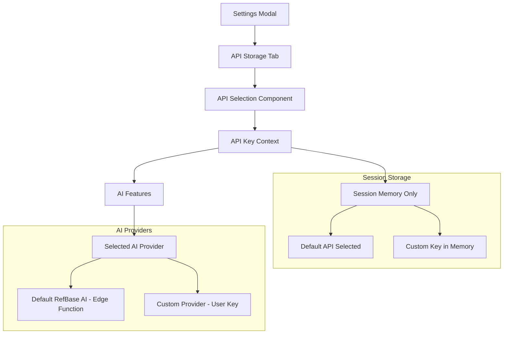

# Design Document

## Overview

The AI API Key Management feature extends the existing RefBase webapp with a simple, secure system for choosing between the webapp's default AI service and a user's custom API key. This feature integrates seamlessly with the current settings modal architecture and provides a foundation for all future AI functionality in the application.

The system offers two options: a default RefBase AI service (using keys stored securely in edge functions) and a session-only custom API key option where users can temporarily use their own provider. Custom keys exist only in memory during the session and are automatically cleared when the session ends, eliminating security concerns while providing flexibility.

## Architecture

### High-Level Architecture



### Component Integration

The feature integrates with the existing architecture by:
- Adding a new tab to the existing `SettingsModal` component
- Creating a new `ApiKeyContext` following the pattern of `ThemeContext`
- Using session-only state management (no persistent storage)
- Extending the TypeScript types in `src/types/index.ts`

## Components and Interfaces

### 1. API Storage Tab Component

**Location:** `src/components/ApiStorageTab.tsx`

```typescript
interface ApiStorageTabProps {
  isDark: boolean;
}

interface ApiKeyState {
  mode: 'default' | 'custom';
  provider?: 'openai' | 'openrouter' | 'custom';
  customKey?: string; // Only exists in memory during session
  selectedModel?: string; // For OpenRouter model selection
}
```

**Key Features:**
- Default RefBase AI option (always visible, no configuration needed)
- Provider selection (OpenAI, OpenRouter, Custom)
- Custom API key input field (session-only)
- Model selection dropdown for OpenRouter
- Simple radio button selection interface
- Basic validation for custom key format
- Clear visual indication of active selection

### 2. API Key Context

**Location:** `src/contexts/ApiKeyContext.tsx`

```typescript
interface ApiKeyContextType {
  mode: 'default' | 'custom';
  provider?: 'openai' | 'openrouter' | 'custom';
  customKey?: string;
  selectedModel?: string;
  availableModels: string[];
  setMode: (mode: 'default' | 'custom') => void;
  setProvider: (provider: 'openai' | 'openrouter' | 'custom') => void;
  setCustomKey: (key: string) => void;
  setSelectedModel: (model: string) => void;
  clearCustomKey: () => void;
  getActiveApiConfig: () => ApiConfig;
  isCustomKeyValid: boolean;
}

interface ApiConfig {
  provider: 'default' | 'openai' | 'openrouter' | 'custom';
  apiKey?: string;
  model?: string;
  baseUrl?: string;
  useDefault: boolean;
}
```

### 3. API Key Validation Service

**Location:** `src/lib/apiKeyService.ts`

```typescript
class ApiKeyService {
  // Basic validation
  validateApiKeyFormat(apiKey: string): boolean
  
  // Configuration
  getApiConfig(mode: 'default' | 'custom', customKey?: string): ApiConfig
  
  // Session cleanup
  clearSessionData(): void
}
```

### 4. Settings Modal Integration

**Updates to:** `src/components/SettingsModal.tsx`

- Add 'api-storage' tab to `settingsTabs` array with Key icon
- Import and render `ApiStorageTab` component in `renderTabContent()`
- Maintain existing modal structure and styling patterns

## Data Models

### Session-Only State

```typescript
// Session State (Memory Only)
interface ApiKeySessionState {
  mode: 'default' | 'custom';
  customKey?: string; // Never persisted
  isValid: boolean;
}

// No persistent storage - all data cleared on session end
```

### Type Extensions

**Updates to:** `src/types/index.ts`

```typescript
export interface ApiKeyState {
  mode: 'default' | 'custom';
  provider?: 'openai' | 'openrouter' | 'custom';
  customKey?: string;
  selectedModel?: string;
}

export interface ApiConfig {
  provider: 'default' | 'openai' | 'openrouter' | 'custom';
  apiKey?: string;
  model?: string;
  baseUrl?: string;
  useDefault: boolean;
}

export type ApiMode = 'default' | 'custom';
export type ApiProvider = 'openai' | 'openrouter' | 'custom';
```

## Error Handling

### Validation Errors
- Empty name or API key fields
- Duplicate API key names
- Invalid API key formats
- API key authentication failures

### Storage Errors
- Local storage quota exceeded
- Encryption/decryption failures
- Network connectivity issues

### API Errors
- Invalid API responses
- Rate limiting
- Authentication failures
- Service unavailability

### Error Recovery
- Automatic fallback to default API when selected key fails
- Graceful degradation of AI features
- User notification system for API issues
- Retry mechanisms for transient failures

## Testing Strategy

### Unit Tests
- API key encryption/decryption
- Validation logic
- Storage operations
- Context state management

### Integration Tests
- Settings modal tab integration
- API key selection flow
- Context provider integration
- Service layer interactions

### End-to-End Tests
- Complete API key management workflow
- Settings modal navigation
- API key switching functionality
- Error handling scenarios

### Security Tests
- Encryption strength validation
- Storage security verification
- API key exposure prevention
- Memory cleanup verification

## Security Considerations

### Encryption
- Use Web Crypto API for client-side encryption
- Generate unique salt per user session
- Implement secure key derivation (PBKDF2)
- Clear sensitive data from memory after use

### Storage Security
- Never store plain-text API keys
- Use secure random IDs for API key entries
- Implement automatic cleanup on logout
- Validate encryption integrity on load

### API Key Protection
- Mask API keys in UI (show only last 4 characters)
- Prevent API keys from appearing in logs
- Implement secure transmission to AI providers
- Use HTTPS for all API communications

### Access Control
- Tie API keys to user sessions
- Implement proper authentication checks
- Prevent cross-user API key access
- Secure context provider boundaries

## Performance Considerations

### Lazy Loading
- Load API keys only when settings modal opens
- Defer encryption/decryption until needed
- Cache decrypted keys temporarily during active use

### Memory Management
- Clear sensitive data from memory promptly
- Implement proper cleanup in useEffect hooks
- Avoid unnecessary re-renders in context

### Storage Optimization
- Compress encrypted data before storage
- Implement efficient serialization
- Use incremental updates for large key collections

## Future Extensibility

### Provider Support
- Modular provider configuration system
- Plugin architecture for new AI providers
- Custom provider endpoint configuration
- Provider-specific feature flags

### Advanced Features
- API key usage analytics
- Cost tracking per provider
- Automatic key rotation
- Team-shared API keys (future enterprise feature)

### Integration Points
- Webhook support for key validation
- SSO integration for enterprise keys
- Audit logging for key usage
- Backup/restore functionality