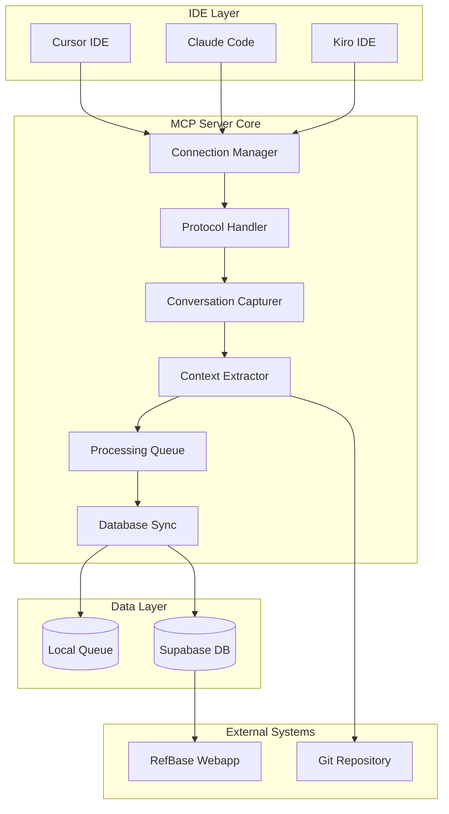
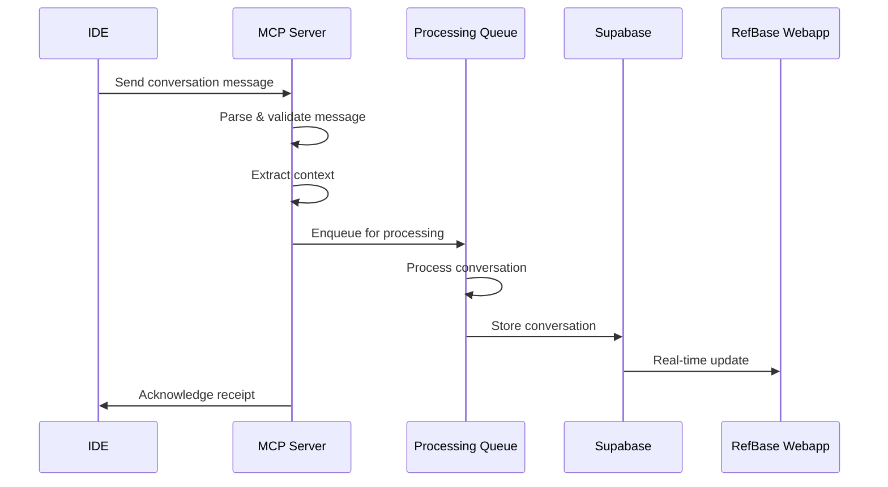
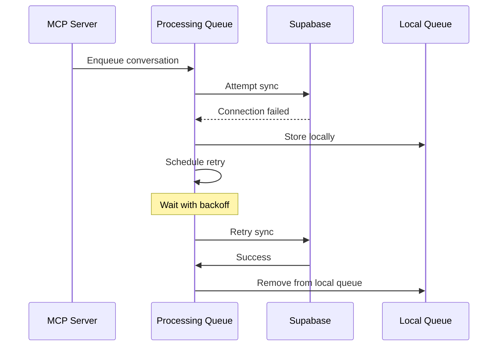

# Design Document

## Overview

The RefBase MCP Server is a Node.js application that implements the Model Context Protocol (MCP) to automatically capture AI conversations from IDEs and sync them with the RefBase webapp. It serves as the bridge between IDE-based AI interactions and the RefBase knowledge management system.

**Architecture Principles:**
- **Protocol Compliance**: Full MCP specification implementation
- **Real-time Processing**: Immediate conversation capture and sync
- **Fault Tolerance**: Graceful error handling and recovery
- **Scalability**: Support for multiple concurrent IDE connections
- **Security**: Encrypted data handling and secure authentication

**Integration Architecture:**
```
┌─────────────────┐    ┌──────────────────┐    ┌──────────────────┐
│ IDE             │    │ RefBase MCP      │    │ Supabase         │
│ (Cursor/Claude) │◄──►│ Server           │◄──►│ Database         │
│                 │    │ (Node.js)        │    │                  │
└─────────────────┘    └──────────────────┘    └──────────────────┘
                                │                        │
                                │                        │
                                ▼                        ▼
                       ┌──────────────────┐    ┌──────────────────┐
                       │ Local Queue      │    │ RefBase Webapp   │
                       │ (Backup)         │    │ (Real-time UI)   │
                       └──────────────────┘    └──────────────────┘
```

## Architecture

### System Architecture Overview

The MCP Server follows a modular, event-driven architecture designed for reliability and scalability:



### Core Components

#### 1. Connection Manager
**Purpose**: Manages MCP connections to multiple IDEs with authentication and reconnection logic.

**Key Responsibilities:**
- Establish and maintain MCP connections
- Handle authentication and authorization
- Manage connection lifecycle and health monitoring
- Implement reconnection strategies with exponential backoff

**Implementation Details:**
```typescript
interface ConnectionManager {
  connections: Map<string, MCPConnection>;
  
  connect(ideConfig: IDEConfig): Promise<MCPConnection>;
  disconnect(connectionId: string): Promise<void>;
  reconnect(connectionId: string): Promise<void>;
  healthCheck(): Promise<ConnectionHealth[]>;
  
  // Event handlers
  onConnect(callback: (connection: MCPConnection) => void): void;
  onDisconnect(callback: (connectionId: string) => void): void;
  onMessage(callback: (message: MCPMessage) => void): void;
}

interface MCPConnection {
  id: string;
  ideType: 'cursor' | 'claude' | 'kiro';
  status: 'connected' | 'disconnected' | 'reconnecting';
  lastActivity: Date;
  messageCount: number;
  
  send(message: MCPMessage): Promise<void>;
  close(): Promise<void>;
}

interface IDEConfig {
  type: 'cursor' | 'claude' | 'kiro';
  endpoint: string;
  authentication: AuthConfig;
  reconnectAttempts: number;
  heartbeatInterval: number;
}
```

#### 2. Protocol Handler
**Purpose**: Implements MCP protocol specification for message parsing and validation.

**Key Responsibilities:**
- Parse incoming MCP messages
- Validate message format and content
- Handle protocol-specific error conditions
- Maintain protocol state and session management

**Implementation Details:**
```typescript
interface ProtocolHandler {
  parseMessage(rawMessage: string): MCPMessage;
  validateMessage(message: MCPMessage): ValidationResult;
  createResponse(request: MCPMessage): MCPMessage;
  handleProtocolError(error: ProtocolError): void;
}

interface MCPMessage {
  id: string;
  type: 'conversation' | 'session_start' | 'session_end' | 'heartbeat';
  timestamp: Date;
  payload: any;
  metadata: MessageMetadata;
}

interface MessageMetadata {
  ideType: string;
  sessionId: string;
  projectPath?: string;
  userId?: string;
}

enum MessageType {
  CONVERSATION_START = 'conversation_start',
  CONVERSATION_MESSAGE = 'conversation_message',
  CONVERSATION_END = 'conversation_end',
  FILE_CHANGE = 'file_change',
  SESSION_UPDATE = 'session_update',
  HEARTBEAT = 'heartbeat'
}
```

#### 3. Conversation Capturer
**Purpose**: Captures and processes AI conversations from IDE sessions.

**Key Responsibilities:**
- Extract conversation messages and metadata
- Preserve message formatting and code blocks
- Track conversation flow and session boundaries
- Handle conversation state management

**Implementation Details:**
```typescript
interface ConversationCapturer {
  captureConversation(message: MCPMessage): Promise<CapturedConversation>;
  processMessage(message: ConversationMessage): Promise<ProcessedMessage>;
  endConversation(sessionId: string): Promise<ConversationSummary>;
}

interface CapturedConversation {
  id: string;
  sessionId: string;
  title: string;
  messages: ConversationMessage[];
  startTime: Date;
  endTime?: Date;
  projectContext: ProjectContext;
  metadata: ConversationMetadata;
}

interface ConversationMessage {
  id: string;
  role: 'user' | 'assistant';
  content: string;
  codeBlocks: CodeBlock[];
  timestamp: Date;
  fileReferences: FileReference[];
  commandsExecuted: Command[];
}

interface CodeBlock {
  language: string;
  code: string;
  filename?: string;
  startLine?: number;
  endLine?: number;
}

interface FileReference {
  path: string;
  action: 'read' | 'write' | 'create' | 'delete';
  beforeContent?: string;
  afterContent?: string;
  lineNumbers?: { start: number; end: number };
}
```

#### 4. Context Extractor
**Purpose**: Extracts rich project context from IDE sessions and file system.

**Key Responsibilities:**
- Detect project structure and metadata
- Extract git repository information
- Capture file changes and dependencies
- Analyze project context for conversation relevance

**Implementation Details:**
```typescript
interface ContextExtractor {
  extractProjectContext(projectPath: string): Promise<ProjectContext>;
  extractGitContext(projectPath: string): Promise<GitContext>;
  extractFileChanges(session: ConversationSession): Promise<FileChange[]>;
  extractDependencies(projectPath: string): Promise<Dependency[]>;
}

interface ProjectContext {
  projectPath: string;
  projectName: string;
  projectType: 'web' | 'mobile' | 'desktop' | 'library' | 'unknown';
  techStack: TechStack;
  gitContext: GitContext;
  dependencies: Dependency[];
  recentChanges: FileChange[];
}

interface GitContext {
  repository: string;
  branch: string;
  commit: string;
  isDirty: boolean;
  recentCommits: GitCommit[];
  changedFiles: string[];
}

interface TechStack {
  languages: string[];
  frameworks: string[];
  buildTools: string[];
  packageManager: string;
  runtime: string;
}

interface Dependency {
  name: string;
  version: string;
  type: 'production' | 'development' | 'peer';
  source: 'npm' | 'pip' | 'gem' | 'cargo' | 'other';
}

interface FileChange {
  filePath: string;
  changeType: 'create' | 'modify' | 'delete' | 'rename';
  beforeContent?: string;
  afterContent: string;
  timestamp: Date;
  associatedConversation?: string;
}
```

#### 5. Processing Queue
**Purpose**: Manages asynchronous processing of captured conversations with retry logic.

**Key Responsibilities:**
- Queue conversations for processing
- Implement retry logic with exponential backoff
- Handle processing failures and dead letter queues
- Provide processing status and metrics

**Implementation Details:**
```typescript
interface ProcessingQueue {
  enqueue(conversation: CapturedConversation): Promise<void>;
  process(): Promise<void>;
  retry(jobId: string): Promise<void>;
  getStatus(): QueueStatus;
}

interface QueueJob {
  id: string;
  type: 'conversation' | 'context_extraction' | 'sync';
  data: any;
  attempts: number;
  maxAttempts: number;
  createdAt: Date;
  processedAt?: Date;
  status: 'pending' | 'processing' | 'completed' | 'failed';
  error?: string;
}

interface QueueStatus {
  pending: number;
  processing: number;
  completed: number;
  failed: number;
  averageProcessingTime: number;
}

class ProcessingQueue {
  private jobs: Map<string, QueueJob> = new Map();
  private workers: Worker[] = [];
  
  async enqueue(job: QueueJob): Promise<void> {
    this.jobs.set(job.id, job);
    await this.processNext();
  }
  
  private async processNext(): Promise<void> {
    const pendingJob = Array.from(this.jobs.values())
      .find(job => job.status === 'pending');
    
    if (pendingJob) {
      await this.processJob(pendingJob);
    }
  }
  
  private async processJob(job: QueueJob): Promise<void> {
    job.status = 'processing';
    job.attempts++;
    
    try {
      await this.executeJob(job);
      job.status = 'completed';
      job.processedAt = new Date();
    } catch (error) {
      if (job.attempts < job.maxAttempts) {
        job.status = 'pending';
        setTimeout(() => this.processNext(), this.calculateBackoff(job.attempts));
      } else {
        job.status = 'failed';
        job.error = error.message;
      }
    }
  }
  
  private calculateBackoff(attempts: number): number {
    return Math.min(1000 * Math.pow(2, attempts), 30000);
  }
}
```

#### 6. Database Sync
**Purpose**: Synchronizes captured conversations with Supabase database and RefBase webapp.

**Key Responsibilities:**
- Store conversations in universal database schema
- Trigger real-time updates to webapp
- Handle database connection failures
- Maintain data consistency and integrity

**Implementation Details:**
```typescript
interface DatabaseSync {
  syncConversation(conversation: CapturedConversation): Promise<void>;
  syncProjectContext(context: ProjectContext): Promise<void>;
  triggerRealtimeUpdate(conversationId: string): Promise<void>;
  handleSyncFailure(error: SyncError): Promise<void>;
}

interface SyncResult {
  success: boolean;
  conversationId: string;
  timestamp: Date;
  error?: string;
  retryCount: number;
}

class DatabaseSync {
  private supabase: SupabaseClient;
  private localQueue: LocalQueue;
  
  constructor(supabaseUrl: string, supabaseKey: string) {
    this.supabase = createClient(supabaseUrl, supabaseKey);
    this.localQueue = new LocalQueue();
  }
  
  async syncConversation(conversation: CapturedConversation): Promise<void> {
    try {
      // Transform to universal conversation format
      const universalConversation = this.transformToUniversalFormat(conversation);
      
      // Insert into database
      const { data, error } = await this.supabase
        .from('conversations')
        .insert(universalConversation);
      
      if (error) throw error;
      
      // Trigger real-time update
      await this.triggerRealtimeUpdate(conversation.id);
      
    } catch (error) {
      // Queue for retry if database unavailable
      await this.localQueue.enqueue({
        type: 'conversation_sync',
        data: conversation,
        timestamp: new Date()
      });
      throw error;
    }
  }
  
  private transformToUniversalFormat(conversation: CapturedConversation): any {
    return {
      id: conversation.id,
      source: 'mcp',
      session_id: conversation.sessionId,
      title: conversation.title,
      project_context: conversation.projectContext,
      raw_data: conversation,
      created_at: conversation.startTime,
      updated_at: new Date()
    };
  }
}
```

### Data Flow Architecture

#### Conversation Capture Flow


#### Error Handling Flow


### Configuration Management

#### Server Configuration
```typescript
interface ServerConfig {
  server: {
    port: number;
    host: string;
    environment: 'development' | 'production';
  };
  
  database: {
    supabaseUrl: string;
    supabaseKey: string;
    connectionPoolSize: number;
    retryAttempts: number;
  };
  
  ides: {
    cursor: IDEConfig;
    claude: IDEConfig;
    kiro: IDEConfig;
  };
  
  processing: {
    queueSize: number;
    workerCount: number;
    retryAttempts: number;
    backoffMultiplier: number;
  };
  
  logging: {
    level: 'debug' | 'info' | 'warn' | 'error';
    file: string;
    maxSize: string;
    maxFiles: number;
  };
  
  security: {
    encryptionKey: string;
    apiKeys: string[];
    rateLimiting: RateLimitConfig;
  };
}

interface RateLimitConfig {
  windowMs: number;
  maxRequests: number;
  skipSuccessfulRequests: boolean;
}
```

#### Environment Configuration
```bash
# Server Configuration
MCP_SERVER_PORT=3001
MCP_SERVER_HOST=localhost
NODE_ENV=production

# Database Configuration
SUPABASE_URL=https://your-project.supabase.co
SUPABASE_ANON_KEY=your-anon-key
SUPABASE_SERVICE_KEY=your-service-key

# IDE Configuration
CURSOR_ENDPOINT=ws://localhost:8080/mcp
CLAUDE_ENDPOINT=ws://localhost:8081/mcp
KIRO_ENDPOINT=ws://localhost:8082/mcp

# Security Configuration
ENCRYPTION_KEY=your-encryption-key
API_KEYS=key1,key2,key3

# Processing Configuration
QUEUE_SIZE=1000
WORKER_COUNT=4
RETRY_ATTEMPTS=3

# Logging Configuration
LOG_LEVEL=info
LOG_FILE=./logs/mcp-server.log
LOG_MAX_SIZE=10m
LOG_MAX_FILES=5
```

## Components and Interfaces

### MCP Protocol Implementation

#### Message Types and Handlers
```typescript
enum MCPMessageType {
  CONVERSATION_START = 'conversation_start',
  CONVERSATION_MESSAGE = 'conversation_message',
  CONVERSATION_END = 'conversation_end',
  FILE_CHANGE = 'file_change',
  SESSION_UPDATE = 'session_update',
  HEARTBEAT = 'heartbeat',
  ERROR = 'error'
}

interface MCPMessageHandler {
  handleConversationStart(message: ConversationStartMessage): Promise<void>;
  handleConversationMessage(message: ConversationMessageData): Promise<void>;
  handleConversationEnd(message: ConversationEndMessage): Promise<void>;
  handleFileChange(message: FileChangeMessage): Promise<void>;
  handleSessionUpdate(message: SessionUpdateMessage): Promise<void>;
  handleHeartbeat(message: HeartbeatMessage): Promise<void>;
  handleError(message: ErrorMessage): Promise<void>;
}

interface ConversationStartMessage {
  sessionId: string;
  projectPath: string;
  userId?: string;
  timestamp: Date;
  metadata: SessionMetadata;
}

interface ConversationMessageData {
  sessionId: string;
  messageId: string;
  role: 'user' | 'assistant';
  content: string;
  codeBlocks: CodeBlock[];
  fileReferences: FileReference[];
  timestamp: Date;
}

interface ConversationEndMessage {
  sessionId: string;
  endTime: Date;
  summary: SessionSummary;
  outcome: SessionOutcome;
}

interface SessionSummary {
  messageCount: number;
  codeBlockCount: number;
  filesModified: number;
  duration: number;
  topics: string[];
}

interface SessionOutcome {
  wasSuccessful: boolean;
  confidence: number;
  evidence: string[];
  implementationCompleted: boolean;
  testsRan: boolean;
  testsPassed: boolean;
}
```

### IDE-Specific Adapters

#### Cursor IDE Adapter
```typescript
class CursorAdapter implements IDEAdapter {
  private connection: WebSocket;
  
  async connect(config: IDEConfig): Promise<void> {
    this.connection = new WebSocket(config.endpoint);
    await this.setupEventHandlers();
    await this.authenticate(config.authentication);
  }
  
  async captureConversation(): Promise<CapturedConversation> {
    // Cursor-specific conversation capture logic
    const messages = await this.extractMessages();
    const context = await this.extractCursorContext();
    
    return {
      id: generateId(),
      sessionId: this.currentSessionId,
      messages,
      projectContext: context,
      source: 'cursor'
    };
  }
  
  private async extractCursorContext(): Promise<ProjectContext> {
    // Extract Cursor-specific project information
    const workspaceInfo = await this.getWorkspaceInfo();
    const gitInfo = await this.getGitInfo();
    const fileChanges = await this.getRecentFileChanges();
    
    return {
      projectPath: workspaceInfo.path,
      projectName: workspaceInfo.name,
      gitContext: gitInfo,
      recentChanges: fileChanges,
      techStack: await this.detectTechStack(workspaceInfo.path)
    };
  }
}
```

#### Claude Code Adapter
```typescript
class ClaudeAdapter implements IDEAdapter {
  private connection: WebSocket;
  
  async connect(config: IDEConfig): Promise<void> {
    this.connection = new WebSocket(config.endpoint);
    await this.setupClaudeEventHandlers();
    await this.authenticate(config.authentication);
  }
  
  async captureConversation(): Promise<CapturedConversation> {
    // Claude-specific conversation capture logic
    const conversation = await this.extractClaudeConversation();
    const context = await this.extractClaudeContext();
    
    return {
      ...conversation,
      projectContext: context,
      source: 'claude'
    };
  }
  
  private async extractClaudeContext(): Promise<ProjectContext> {
    // Extract Claude-specific project information
    const projectInfo = await this.getClaudeProjectInfo();
    const codebaseInfo = await this.getCodebaseInfo();
    
    return {
      projectPath: projectInfo.rootPath,
      projectName: projectInfo.name,
      gitContext: await this.getGitContext(),
      dependencies: await this.extractDependencies(),
      techStack: codebaseInfo.techStack
    };
  }
}
```

#### Kiro IDE Adapter
```typescript
class KiroAdapter implements IDEAdapter {
  private connection: WebSocket;
  
  async connect(config: IDEConfig): Promise<void> {
    this.connection = new WebSocket(config.endpoint);
    await this.setupKiroEventHandlers();
    await this.authenticate(config.authentication);
  }
  
  async captureConversation(): Promise<CapturedConversation> {
    // Kiro-specific conversation capture logic
    const conversation = await this.extractKiroConversation();
    const context = await this.extractKiroContext();
    
    return {
      ...conversation,
      projectContext: context,
      source: 'kiro'
    };
  }
  
  private async extractKiroContext(): Promise<ProjectContext> {
    // Extract Kiro-specific project information
    const workspace = await this.getKiroWorkspace();
    const specs = await this.getKiroSpecs();
    
    return {
      projectPath: workspace.path,
      projectName: workspace.name,
      gitContext: await this.getGitContext(),
      kiroSpecs: specs, // Kiro-specific: include spec information
      techStack: await this.detectTechStack(workspace.path)
    };
  }
}
```

### Local Queue and Backup System

#### Local Storage for Offline Resilience
```typescript
interface LocalQueue {
  enqueue(item: QueueItem): Promise<void>;
  dequeue(): Promise<QueueItem | null>;
  peek(): Promise<QueueItem | null>;
  size(): Promise<number>;
  clear(): Promise<void>;
}

interface QueueItem {
  id: string;
  type: 'conversation' | 'context' | 'sync';
  data: any;
  timestamp: Date;
  attempts: number;
  maxAttempts: number;
}

class FileBasedLocalQueue implements LocalQueue {
  private queueDir: string;
  
  constructor(queueDir: string = './queue') {
    this.queueDir = queueDir;
    this.ensureQueueDirectory();
  }
  
  async enqueue(item: QueueItem): Promise<void> {
    const filename = `${item.timestamp.getTime()}-${item.id}.json`;
    const filepath = path.join(this.queueDir, filename);
    
    await fs.writeFile(filepath, JSON.stringify(item, null, 2));
  }
  
  async dequeue(): Promise<QueueItem | null> {
    const files = await fs.readdir(this.queueDir);
    if (files.length === 0) return null;
    
    // Get oldest file
    const oldestFile = files.sort()[0];
    const filepath = path.join(this.queueDir, oldestFile);
    
    const content = await fs.readFile(filepath, 'utf-8');
    const item = JSON.parse(content) as QueueItem;
    
    await fs.unlink(filepath);
    return item;
  }
  
  async size(): Promise<number> {
    const files = await fs.readdir(this.queueDir);
    return files.length;
  }
  
  private async ensureQueueDirectory(): Promise<void> {
    try {
      await fs.access(this.queueDir);
    } catch {
      await fs.mkdir(this.queueDir, { recursive: true });
    }
  }
}
```

## Data Models

### Core Data Models

#### Universal Conversation Model (MCP Source)
```typescript
interface MCPConversation {
  id: string;
  source: 'mcp';
  sessionId: string;
  ideType: 'cursor' | 'claude' | 'kiro';
  title: string;
  messages: MCPMessage[];
  
  // Rich MCP-specific context
  projectContext: {
    projectPath: string;
    projectName: string;
    gitContext: GitContext;
    techStack: TechStack;
    dependencies: Dependency[];
    recentChanges: FileChange[];
    workspaceInfo: WorkspaceInfo;
  };
  
  // Session tracking
  sessionMetrics: {
    startTime: Date;
    endTime?: Date;
    duration?: number;
    messageCount: number;
    codeBlockCount: number;
    filesModified: number;
    commandsExecuted: number;
  };
  
  // Outcome tracking
  outcome?: {
    wasSuccessful: boolean;
    confidence: number;
    evidence: string[];
    implementationCompleted: boolean;
    testsRan: boolean;
    testsPassed: boolean;
    gitCommits: string[];
  };
  
  // Preserve original MCP data
  rawData: any;
  
  createdAt: Date;
  updatedAt: Date;
  processedAt?: Date;
}

interface WorkspaceInfo {
  path: string;
  name: string;
  type: 'web' | 'mobile' | 'desktop' | 'library';
  openFiles: string[];
  activeFile?: string;
  recentFiles: string[];
}
```

#### Session Tracking Models
```typescript
interface AISession {
  id: string;
  conversationId: string;
  ideType: string;
  projectId: string;
  userId?: string;
  
  startTime: Date;
  endTime?: Date;
  duration?: number;
  
  // Context provided to AI
  providedContext: {
    relevantPatterns: string[];
    similarConversations: string[];
    projectContext: ProjectContext;
    recentChanges: FileChange[];
  };
  
  // Implementation tracking
  implementation: {
    filesCreated: string[];
    filesModified: string[];
    filesDeleted: string[];
    commandsExecuted: Command[];
    dependenciesAdded: Dependency[];
    configChanges: ConfigChange[];
  };
  
  // Outcome assessment
  outcome: SessionOutcome;
  
  // Learning data
  extractedPatterns: Pattern[];
  successMetrics: SuccessMetrics;
  
  createdAt: Date;
  updatedAt: Date;
}

interface SuccessMetrics {
  implementationTime: number;
  errorCount: number;
  retryCount: number;
  testPassRate: number;
  codeQualityScore: number;
  userSatisfaction?: number;
}

interface Command {
  command: string;
  args: string[];
  workingDirectory: string;
  exitCode: number;
  output: string;
  timestamp: Date;
}

interface ConfigChange {
  file: string;
  changeType: 'create' | 'modify' | 'delete';
  beforeContent?: string;
  afterContent: string;
  purpose: string;
}
```

#### Pattern Extraction Models
```typescript
interface ExtractedPattern {
  id: string;
  name: string;
  description: string;
  category: 'implementation' | 'bug_fix' | 'refactor' | 'setup';
  
  // Source information
  extractedFromSession: string;
  extractedFromConversation: string;
  extractionConfidence: number;
  
  // Pattern details
  implementationSteps: ImplementationStep[];
  codeTemplates: CodeTemplate[];
  filePatterns: FilePattern[];
  dependencyPatterns: DependencyPattern[];
  
  // Context and usage
  contextClues: string[];
  prerequisites: string[];
  commonIssues: Issue[];
  successIndicators: string[];
  
  // Metrics
  usageCount: number;
  successRate: number;
  averageImplementationTime: number;
  
  // Metadata
  tags: string[];
  techStack: string[];
  complexity: 'simple' | 'medium' | 'complex';
  
  createdAt: Date;
  updatedAt: Date;
  lastUsed?: Date;
}

interface ImplementationStep {
  order: number;
  description: string;
  action: 'create_file' | 'modify_file' | 'run_command' | 'install_dependency';
  target: string;
  content?: string;
  explanation: string;
  optional: boolean;
}

interface CodeTemplate {
  name: string;
  language: string;
  template: string;
  variables: TemplateVariable[];
  description: string;
}

interface TemplateVariable {
  name: string;
  type: 'string' | 'number' | 'boolean' | 'array';
  description: string;
  defaultValue?: any;
  required: boolean;
}

interface FilePattern {
  pathPattern: string;
  contentPattern?: string;
  purpose: string;
  frequency: number;
}

interface DependencyPattern {
  name: string;
  versionPattern: string;
  purpose: string;
  frequency: number;
  alternatives: string[];
}

interface Issue {
  description: string;
  symptoms: string[];
  solution: string;
  prevention: string;
  frequency: number;
}
```

## Error Handling

### Error Classification and Handling Strategy

#### Error Types and Recovery Strategies
```typescript
enum ErrorType {
  CONNECTION_ERROR = 'connection_error',
  PROTOCOL_ERROR = 'protocol_error',
  PROCESSING_ERROR = 'processing_error',
  DATABASE_ERROR = 'database_error',
  VALIDATION_ERROR = 'validation_error',
  AUTHENTICATION_ERROR = 'authentication_error',
  RATE_LIMIT_ERROR = 'rate_limit_error',
  RESOURCE_ERROR = 'resource_error'
}

interface ErrorHandler {
  handleError(error: MCPError): Promise<ErrorResponse>;
  shouldRetry(error: MCPError): boolean;
  calculateBackoff(attempt: number): number;
  escalateError(error: MCPError): Promise<void>;
}

class MCPError extends Error {
  constructor(
    message: string,
    public type: ErrorType,
    public code: string,
    public retryable: boolean = false,
    public context?: any
  ) {
    super(message);
    this.name = 'MCPError';
  }
}

class ErrorHandler {
  async handleError(error: MCPError): Promise<ErrorResponse> {
    // Log error with context
    logger.error('MCP Error occurred', {
      type: error.type,
      code: error.code,
      message: error.message,
      context: error.context,
      stack: error.stack
    });
    
    // Determine recovery strategy
    switch (error.type) {
      case ErrorType.CONNECTION_ERROR:
        return this.handleConnectionError(error);
      
      case ErrorType.DATABASE_ERROR:
        return this.handleDatabaseError(error);
      
      case ErrorType.PROCESSING_ERROR:
        return this.handleProcessingError(error);
      
      default:
        return this.handleGenericError(error);
    }
  }
  
  private async handleConnectionError(error: MCPError): Promise<ErrorResponse> {
    if (error.retryable) {
      // Schedule reconnection
      await this.scheduleReconnection(error.context.connectionId);
      return { action: 'retry', delay: this.calculateBackoff(error.context.attempt) };
    } else {
      // Escalate to manual intervention
      await this.escalateError(error);
      return { action: 'escalate', requiresManualIntervention: true };
    }
  }
  
  private async handleDatabaseError(error: MCPError): Promise<ErrorResponse> {
    // Queue data locally for later sync
    await this.queueForLocalStorage(error.context.data);
    
    if (error.retryable) {
      return { action: 'retry', delay: this.calculateBackoff(error.context.attempt) };
    } else {
      return { action: 'queue_locally', message: 'Data queued for later sync' };
    }
  }
  
  calculateBackoff(attempt: number): number {
    // Exponential backoff with jitter
    const baseDelay = 1000; // 1 second
    const maxDelay = 30000; // 30 seconds
    const exponentialDelay = baseDelay * Math.pow(2, attempt);
    const jitter = Math.random() * 1000; // Add up to 1 second of jitter
    
    return Math.min(exponentialDelay + jitter, maxDelay);
  }
}

interface ErrorResponse {
  action: 'retry' | 'escalate' | 'queue_locally' | 'ignore';
  delay?: number;
  requiresManualIntervention?: boolean;
  message?: string;
}
```

### Circuit Breaker Pattern
```typescript
class CircuitBreaker {
  private failures: number = 0;
  private lastFailureTime: Date | null = null;
  private state: 'closed' | 'open' | 'half-open' = 'closed';
  
  constructor(
    private failureThreshold: number = 5,
    private recoveryTimeout: number = 60000, // 1 minute
    private successThreshold: number = 3
  ) {}
  
  async execute<T>(operation: () => Promise<T>): Promise<T> {
    if (this.state === 'open') {
      if (this.shouldAttemptReset()) {
        this.state = 'half-open';
      } else {
        throw new MCPError(
          'Circuit breaker is open',
          ErrorType.RESOURCE_ERROR,
          'CIRCUIT_BREAKER_OPEN',
          false
        );
      }
    }
    
    try {
      const result = await operation();
      this.onSuccess();
      return result;
    } catch (error) {
      this.onFailure();
      throw error;
    }
  }
  
  private shouldAttemptReset(): boolean {
    return this.lastFailureTime !== null &&
           Date.now() - this.lastFailureTime.getTime() > this.recoveryTimeout;
  }
  
  private onSuccess(): void {
    this.failures = 0;
    this.state = 'closed';
  }
  
  private onFailure(): void {
    this.failures++;
    this.lastFailureTime = new Date();
    
    if (this.failures >= this.failureThreshold) {
      this.state = 'open';
    }
  }
}
```

## Testing Strategy

### Unit Testing
```typescript
// Example test for ConversationCapturer
describe('ConversationCapturer', () => {
  let capturer: ConversationCapturer;
  let mockProtocolHandler: jest.Mocked<ProtocolHandler>;
  
  beforeEach(() => {
    mockProtocolHandler = createMockProtocolHandler();
    capturer = new ConversationCapturer(mockProtocolHandler);
  });
  
  describe('captureConversation', () => {
    it('should capture conversation with all messages', async () => {
      const mockMessage = createMockMCPMessage();
      const result = await capturer.captureConversation(mockMessage);
      
      expect(result).toBeDefined();
      expect(result.messages).toHaveLength(1);
      expect(result.sessionId).toBe(mockMessage.metadata.sessionId);
    });
    
    it('should handle malformed messages gracefully', async () => {
      const malformedMessage = { invalid: 'data' } as any;
      
      await expect(capturer.captureConversation(malformedMessage))
        .rejects.toThrow(MCPError);
    });
  });
});
```

### Integration Testing
```typescript
// Example integration test
describe('MCP Server Integration', () => {
  let server: MCPServer;
  let testDatabase: TestDatabase;
  
  beforeAll(async () => {
    testDatabase = await createTestDatabase();
    server = new MCPServer({
      database: testDatabase.config,
      ides: createTestIDEConfig()
    });
    await server.start();
  });
  
  afterAll(async () => {
    await server.stop();
    await testDatabase.cleanup();
  });
  
  it('should capture and sync conversation end-to-end', async () => {
    // Simulate IDE connection
    const mockIDE = new MockIDEConnection();
    await mockIDE.connect(server.getConnectionEndpoint());
    
    // Send conversation
    const conversation = createTestConversation();
    await mockIDE.sendConversation(conversation);
    
    // Verify storage
    await waitFor(async () => {
      const stored = await testDatabase.getConversation(conversation.id);
      expect(stored).toBeDefined();
      expect(stored.source).toBe('mcp');
    });
  });
});
```

### Performance Testing
```typescript
describe('Performance Tests', () => {
  it('should handle high conversation volume', async () => {
    const server = new MCPServer(testConfig);
    const conversations = Array.from({ length: 1000 }, createTestConversation);
    
    const startTime = Date.now();
    
    await Promise.all(
      conversations.map(conv => server.processConversation(conv))
    );
    
    const endTime = Date.now();
    const processingTime = endTime - startTime;
    
    expect(processingTime).toBeLessThan(10000); // Should complete within 10 seconds
  });
  
  it('should maintain memory usage under load', async () => {
    const initialMemory = process.memoryUsage().heapUsed;
    
    // Process many conversations
    for (let i = 0; i < 1000; i++) {
      await server.processConversation(createTestConversation());
    }
    
    // Force garbage collection
    if (global.gc) global.gc();
    
    const finalMemory = process.memoryUsage().heapUsed;
    const memoryIncrease = finalMemory - initialMemory;
    
    // Memory increase should be reasonable (less than 100MB)
    expect(memoryIncrease).toBeLessThan(100 * 1024 * 1024);
  });
});
```

This design provides a comprehensive foundation for building a robust, scalable MCP server that integrates seamlessly with the RefBase webapp while maintaining high reliability and performance standards.