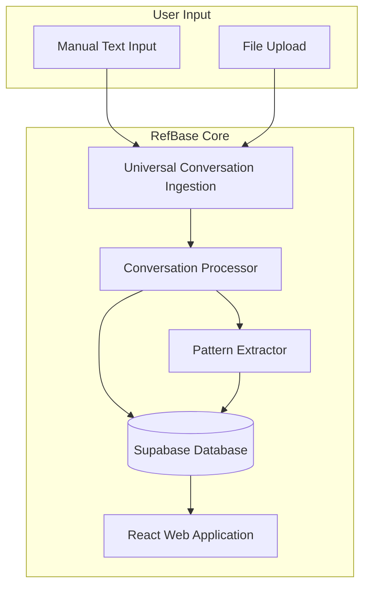
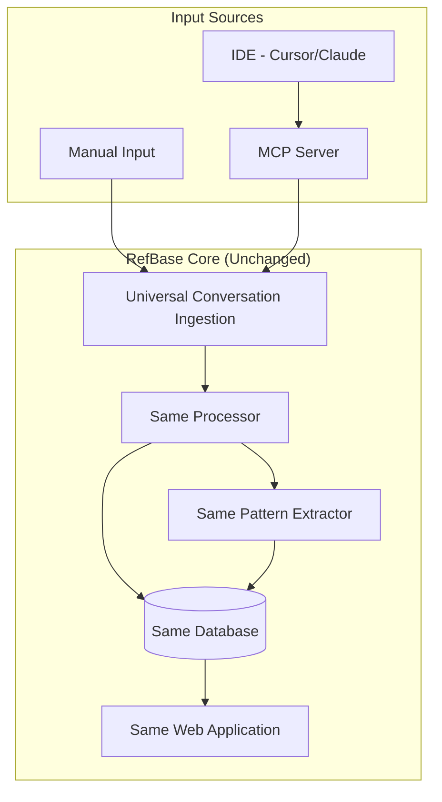
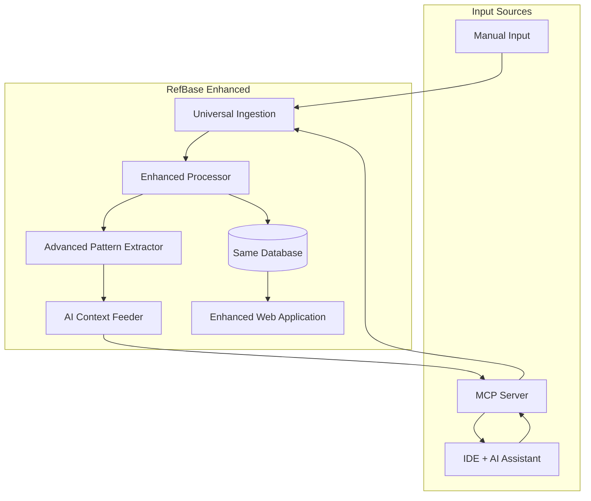

# Design Document

## Overview

RefBase extends an existing project management webapp with intelligent AI conversation capture and learning capabilities using a **phased, MCP-ready architecture**.

**Foundation webapp** already provides: task tracking, bug reporting, document management, team chat, file management, and calendar functionality built with React, TypeScript, Tailwind CSS, and Supabase.

**RefBase enhancement phases:**
- **Phase 1**: Manual conversation import with pattern recognition
- **Phase 2**: MCP server integration for automated capture
- **Phase 3**: Advanced AI learning loop with context feeding

**Key architectural principle**: The system is designed from day 1 to support both manual input and future MCP integration without requiring major refactoring. All data models, processing pipelines, and UI components work universally across input sources.

## Architecture

### Complete System Data Flow

**Full System Overview: How MCP Server and Webapp Work Together**

```
User's Computer:
┌─────────────────┐    ┌──────────────────┐
│ IDE             │    │ MCP Server       │
│ (Cursor/Claude) │───▶│ (Node.js app)    │
│                 │    │ - Captures chats │
│ User chats with │    │ - Processes data │
│ AI assistant    │    │ - Formats it     │
└─────────────────┘    └──────────────────┘
                                │
                                │ HTTP requests
                                ▼
                       ┌──────────────────┐
                       │ Supabase         │
                       │ (Cloud Database) │◀─────┐
                       │ - Stores convos  │      │
                       │ - Stores patterns│      │
                       └──────────────────┘      │
                                │                │
                                │ Real-time sync │
                                ▼                │
                       ┌──────────────────┐      │
                       │ RefBase Webapp   │      │
                       │ (Your React app) │──────┘
                       │ - Shows convos   │
                       │ - Search/analyze │
                       │ - Pattern mgmt   │
                       └──────────────────┘
```

**Key Points:**
- **Two separate projects**: MCP Server (Node.js) + RefBase Webapp (React)
- **Shared database**: Both connect to same Supabase instance
- **Real-time sync**: Webapp updates automatically when MCP captures new conversations
- **Phase 1**: Only webapp (manual input), Phase 2: Add MCP server

### Phased Architecture Design

**Phase 1: Manual Input Foundation**


**Phase 2: MCP Integration (Same Infrastructure)**


**Phase 3: AI Learning Loop (Enhanced)**


### Component Architecture

The system is built using a modular architecture with the following layers:

1. **Presentation Layer**: React-based web application with real-time updates and pattern visualization
2. **API Layer**: Express.js REST API with GraphQL endpoints for complex queries
3. **Business Logic Layer**: Node.js services handling core functionality and pattern learning
4. **Data Layer**: PostgreSQL for structured data, Vector database for semantic search, Pattern library for reusable implementations
5. **Integration Layer**: Enhanced MCP server for IDE communication and AI context feeding
6. **Learning Layer**: AI Learning Loop system for pattern extraction, analysis, and context enhancement

## Universal Component Architecture

### Universal Conversation Ingestion

**Purpose**: Abstract interface supporting multiple input sources

**Key Interfaces**:
- `ConversationIngestion`: Universal interface for all input sources
- `ManualIngestion`: Handles pasted text and file uploads (Phase 1)
- `MCPIngestion`: Handles MCP server data (Phase 2)
- `DataTransformer`: Normalizes all formats to standard conversation model

**Implementation Details**:
```typescript
// Universal conversation interface supporting all phases
interface UniversalConversation {
  id: string;
  source: 'manual' | 'mcp' | 'file';  // Supports all input types
  title: string;
  messages: Message[];
  
  // Optional fields populated differently by source
  sessionId?: string;        // null for manual, populated by MCP
  projectContext?: {         // basic for manual, rich for MCP
    path?: string;
    files?: string[];
    gitInfo?: GitContext;
  };
  
  // Preserve original data regardless of source
  rawData?: any;
  
  metadata: ConversationMetadata;
  createdAt: Date;
  updatedAt: Date;
}

interface ConversationIngestion {
  source: InputSource;
  process(rawData: any): Promise<UniversalConversation>;
  validate(data: any): boolean;
}

// Phase 1 Implementation
class ManualIngestion implements ConversationIngestion {
  source = 'manual';
  
  async process(pastedText: string): Promise<UniversalConversation> {
    // Parse common formats (ChatGPT, Claude exports, etc.)
    const parsed = this.parseText(pastedText);
    return this.normalizeToUniversalFormat(parsed);
  }
}

// Phase 2 Implementation (extends same interface)
class MCPIngestion implements ConversationIngestion {
  source = 'mcp';
  
  async process(mcpData: MCPChatData): Promise<UniversalConversation> {
    // Rich MCP data with project context
    return this.normalizeToUniversalFormat(mcpData);
  }
}
```

### Enhanced Web Application Component

**Purpose**: Extends existing project management webapp with conversation and pattern management

**Foundation Features (Unchanged)**:
- Multi-project workspace with Discord-style navigation
- Task management with Kanban boards
- Bug tracking with status management
- Document, chat, file, and calendar systems
- User authentication and project isolation

**New RefBase Features (All Phases)**:
- **Phase 1**: Manual conversation import, basic pattern recognition, conversation search
- **Phase 2**: Automated MCP import, real-time sync, rich context display
- **Phase 3**: AI context feeding, advanced analytics, team collaboration

**Phase-Agnostic UI Components**:
- `ConversationList`: Works with any conversation source
- `PatternLibrary`: Displays patterns from any extraction method
- `ConversationDetail`: Shows conversations regardless of origin
- `ProjectIntegration`: Links conversations to bugs/tasks universally

**Revolutionary Expandable Interface Components**:
- `ExpandableBugReport`: Transform bug reports into rich AI-powered workspaces
- `ExpandableFeatureWorkspace`: Convert tasks into comprehensive implementation contexts
- `AIContextGenerator`: Create AI-optimized summaries for assistant consumption
- `ConversationReferencePanel`: Direct access to individual conversation files
- `PatternSuccessMetrics`: Display success rates and implementation guidance

**Technology Stack** (Existing):
- Frontend: React 18 with TypeScript
- State Management: React Context and custom hooks
- UI Framework: Tailwind CSS with Radix UI components
- Backend: Supabase (PostgreSQL + Auth + Real-time)
- Real-time: Supabase real-time subscriptions

### Universal Processing Engine

**Purpose**: Source-agnostic conversation analysis and pattern extraction

**Phase 1 Capabilities**:
- Basic text parsing and code block extraction
- Keyword-based categorization
- Simple pattern recognition
- Manual success tagging

**Phase 2 Enhancements**:
- Rich project context analysis
- Git-based success detection
- File change pattern extraction
- Automated implementation tracking

**Phase 3 Additions**:
- Advanced AI-powered analysis
- Context feeding optimization
- Learning feedback integration

**Universal Processing Pipeline**:
```typescript
class UniversalProcessor {
  async process(conversation: UniversalConversation): Promise<ProcessedConversation> {
    const pipeline = [
      this.extractCodeBlocks,
      this.categorizeConversation,
      this.extractPatterns,
      this.evaluateSuccess,
      this.generateSearchIndex
    ];
    
    return await this.runPipeline(conversation, pipeline);
  }
  
  // Methods adapt based on available data richness
  private extractPatterns(conv: UniversalConversation): Pattern[] {
    if (conv.source === 'mcp' && conv.projectContext?.files) {
      return this.extractRichPatterns(conv);  // Phase 2+
    } else {
      return this.extractBasicPatterns(conv); // Phase 1
    }
  }
}
```

### Nested Page Interface Architecture

**Purpose**: Transform clickable project items (bugs, tasks) into dedicated nested pages with rich AI-powered context

**Core Design Principle**: Nested navigation - click any Kanban card to open detailed page with AI context and conversation management

#### Task Detail Nested Page Architecture

**Interface Flow**:
```
Kanban Task Card → [Click] → Task Detail Page → [Back] → Kanban Board
                                  ↓
                         Multi-section page with tabs:
                         • Task Info & Status
                         • AI Summary 
                         • Chat History
                         • Import Conversations
                         • Pattern Analysis
```

**Page Structure**:
```typescript
interface TaskDetailPage {
  taskId: string;
  task: Task;
  
  // AI-powered enhancements
  aiSummary?: AIGeneratedSummary;
  linkedConversations: ConversationReference[];
  patterns: ImplementationPattern[];
  
  // Page sections
  sections: {
    taskInfo: TaskInfoSection;
    aiSummary: AISummarySection;
    chatHistory: ChatHistorySection;
    importSection: ConversationImportSection;
    patternAnalysis: PatternAnalysisSection;
  };
}

interface AIGeneratedSummary {
  content: string;
  lastGenerated: Date;
  basedOnConversations: string[];
  contextForAI: string; // Formatted for AI assistant consumption
  actionableSteps: string[];
  knownPitfalls: string[];
}

interface ConversationReference {
  conversationId: string;
  title: string;
  relevanceScore: number;  // 0-1 based on similarity
  extractedSolution: string;
  successIndicators: string[];
  fileReferences: string[]; // Individual conversation files
}

interface AIContextSummary {
  whatToDo: string[];       // Specific actionable steps
  whatToAvoid: string[];    // Known pitfalls and anti-patterns
  successPattern: string;   // Reference to proven approach
  contextClues: string[];   // When to use this approach
  estimatedEffort: string;  // Time/complexity estimate
  prerequisites: string[];  // Required setup or knowledge
}
```

**Nested Page Component Architecture**:
```typescript
// Task Detail Nested Page Component
interface TaskDetailPageProps {
  taskId: string;
  onBack: () => void; // Navigate back to Kanban board
}

const TaskDetailPage: React.FC<TaskDetailPageProps> = ({ taskId, onBack }) => {
  const [activeTab, setActiveTab] = useState<'info' | 'ai-summary' | 'chat-history' | 'import' | 'patterns'>('info');
  
  return (
    <div className="task-detail-page">
      <TaskDetailHeader taskId={taskId} onBack={onBack} />
      
      <TabNavigation activeTab={activeTab} onTabChange={setActiveTab} />
      
      {activeTab === 'info' && <TaskInfoSection taskId={taskId} />}
      {activeTab === 'ai-summary' && <AISummarySection taskId={taskId} />}
      {activeTab === 'chat-history' && <ChatHistorySection taskId={taskId} />}
      {activeTab === 'import' && <ConversationImportSection taskId={taskId} />}
      {activeTab === 'patterns' && <PatternAnalysisSection taskId={taskId} />}
    </div>
  );
};

// Individual section components
const AISummarySection: React.FC<{taskId: string}> = ({ taskId }) => {
  const [summary, setSummary] = useState<AIGeneratedSummary | null>(null);
  
  const generateSummary = async () => {
    const aiSummary = await AIContextGenerator.generateTaskSummary(taskId);
    setSummary(aiSummary);
  };
  
  return (
    <div className="ai-summary-section">
      <div className="section-header">
        <h3>AI Implementation Summary</h3>
        <Button onClick={generateSummary}>Generate Summary</Button>
      </div>
      
      {summary && (
        <div className="ai-summary-content">
          <div className="summary-for-humans">
            <h4>Implementation Guidance</h4>
            <p>{summary.content}</p>
            <ul>
              {summary.actionableSteps.map(step => <li key={step}>{step}</li>)}
            </ul>
          </div>
          
          <div className="context-for-ai">
            <h4>Context for AI Assistant</h4>
            <pre className="ai-context">{summary.contextForAI}</pre>
            <Button onClick={() => copyToClipboard(summary.contextForAI)}>
              Copy for AI
            </Button>
          </div>
        </div>
      )}
    </div>
  );
};
```

#### Expandable Feature/Task Workspace Architecture

**Interface Flow**:
```
Kanban Task Card → [Expand Button] → Feature Workspace → [Close] → Kanban Card
```

**Component Structure**:
```typescript
interface ExpandableFeature extends Task {
  featureWorkspace: {
    requirements: string[];
    implementationGuide: AIContextSummary;
    relatedConversations: ConversationReference[];
    implementationChecklist: ChecklistItem[];
    successPatterns: FeatureImplementation[];
    similarFeatures: FeatureReference[];
    estimatedComplexity: 'simple' | 'medium' | 'complex';
    riskFactors: string[];
  };
}

interface ChecklistItem {
  id: string;
  description: string;
  completed: boolean;
  dependencies: string[];
  estimatedTime: number;
  relatedConversationId?: string;
}
```

#### AI Context Generation System

**Purpose**: Generate AI-optimized summaries for feeding to AI assistants

```typescript
class AIContextGenerator {
  async generateBugContext(bug: BugReport): Promise<AIContextSummary> {
    const relatedConversations = await this.findRelatedConversations(bug);
    const successPatterns = await this.extractSuccessPatterns(relatedConversations);
    const commonPitfalls = await this.identifyPitfalls(relatedConversations);
    
    return {
      whatToDo: this.extractActionableSteps(successPatterns),
      whatToAvoid: commonPitfalls,
      successPattern: this.identifyBestApproach(successPatterns),
      contextClues: this.generateContextClues(bug, successPatterns),
      estimatedEffort: this.calculateEffort(successPatterns),
      prerequisites: this.identifyPrerequisites(successPatterns)
    };
  }
  
  async generateFeatureContext(task: Task): Promise<AIContextSummary> {
    // Similar process for feature implementation context
    const implementations = await this.findSimilarImplementations(task);
    return this.synthesizeImplementationGuidance(implementations);
  }
  
  // Format output specifically for AI assistant consumption
  formatForAI(context: AIContextSummary): string {
    return `
CONTEXT FOR AI ASSISTANT:
${context.successPattern}

IMPLEMENTATION STEPS:
${context.whatToDo.map(step => `• ${step}`).join('\n')}

AVOID THESE PITFALLS:
${context.whatToAvoid.map(pitfall => `• ${pitfall}`).join('\n')}

ESTIMATED EFFORT: ${context.estimatedEffort}
PREREQUISITES: ${context.prerequisites.join(', ')}
    `.trim();
  }
}
```

### Pattern Learning System

**Purpose**: Extracts successful implementation patterns and feeds them back to AI assistants

**Key Interfaces**:
- `PatternExtractor`: Analyzes successful implementations and extracts reusable patterns
- `SuccessEvaluator`: Determines implementation success and pattern effectiveness
- `ContextFeeder`: Provides relevant patterns to AI sessions as context

**Implementation Details**:
```typescript
interface FeatureImplementation {
  id: string;
  projectId: string;
  name: string;
  category: 'authentication' | 'ui-component' | 'api-endpoint' | 'database' | 'integration';
  conversationId: string;
  implementationSteps: Step[];
  codeChanges: FileChange[];
  dependencies: string[];
  configChanges: ConfigChange[];
  successRate: number;
  complexity: 'simple' | 'medium' | 'complex';
  estimatedTime: number;
  reusableSnippets: CodeSnippet[];
  prerequisites: string[];
  commonIssues: Issue[];
  createdAt: Date;
  lastUsed: Date;
  usageCount: number;
}

interface BugResolutionPattern {
  id: string;
  projectId: string;
  bugType: string;
  symptoms: string[];
  rootCause: string;
  conversationId: string;
  resolutionSteps: Step[];
  codeChanges: FileChange[];
  preventionMeasures: string[];
  errorPatterns: string[];
  contextClues: string[];
  successRate: number;
  averageResolutionTime: number;
  difficulty: 'easy' | 'medium' | 'hard';
}

interface AIContextPackage {
  projectContext: {
    techStack: string[];
    frameworks: string[];
    currentFiles: string[];
    recentChanges: FileChange[];
  };
  relevantPatterns: {
    features: FeatureImplementation[];
    bugFixes: BugResolutionPattern[];
    codeSnippets: CodeSnippet[];
  };
  recommendations: {
    suggestedApproach: string;
    potentialIssues: string[];
    bestPractices: string[];
    timeEstimate: number;
  };
}
```

### Enhanced MCP Server Component

**Purpose**: Handles IDE communication, chat history extraction, and AI context feeding

**Key Interfaces**:
- `ChatHistoryExporter`: Extracts conversation data from IDE sessions
- `ConnectionManager`: Manages IDE connections and authentication
- `DataTransformer`: Converts IDE-specific formats to standardized format
- `ContextProvider`: Feeds relevant patterns and history to AI assistants
- `SessionManager`: Tracks AI sessions and implementation outcomes

**Enhanced Implementation**:
```typescript
interface EnhancedMCPServerConfig {
  name: string;
  version: string;
  capabilities: {
    chatExport: boolean;
    realTimeSync: boolean;
    bulkExport: boolean;
    contextFeeding: boolean;
    patternSuggestion: boolean;
    successTracking: boolean;
  };
}

interface AISession {
  id: string;
  projectId: string;
  startTime: Date;
  endTime?: Date;
  providedContext: AIContextPackage;
  implementationOutcome?: ImplementationOutcome;
  extractedPatterns: Pattern[];
  successMetrics: SuccessMetrics;
}

interface ImplementationOutcome {
  wasSuccessful: boolean;
  confidence: number;
  evidence: string[];
  timeToComplete: number;
  issuesEncountered: Issue[];
  patternsUsed: string[];
  newPatternsCreated: Pattern[];
}
```

### Universal Database Schema (Phase 1 Design)

**Future-Proof Conversations Table**:
```sql
CREATE TABLE conversations (
  id UUID PRIMARY KEY,
  source VARCHAR(20) DEFAULT 'manual',  -- 'manual' | 'mcp' | 'file'
  session_id VARCHAR(255),              -- null for manual, set by MCP
  project_id UUID REFERENCES projects(id),
  title VARCHAR(500),
  category VARCHAR(100),
  
  -- Rich context for MCP, basic for manual
  project_context JSONB,  -- {path?, files?, gitInfo?}
  
  -- Preserve original regardless of source
  raw_data JSONB,
  
  -- Processing results (same for all sources)
  processed_at TIMESTAMP,
  extraction_version INTEGER DEFAULT 1,
  
  created_at TIMESTAMP DEFAULT now(),
  updated_at TIMESTAMP DEFAULT now(),
  metadata JSONB
);

-- Index for both manual and MCP usage patterns
CREATE INDEX idx_conversations_source ON conversations(source);
CREATE INDEX idx_conversations_project_date ON conversations(project_id, created_at);
CREATE INDEX idx_conversations_context ON conversations USING gin(project_context);
```

**Universal Messages Table**:
```sql
CREATE TABLE messages (
  id UUID PRIMARY KEY,
  conversation_id UUID REFERENCES conversations(id),
  role VARCHAR(20),           -- 'user' | 'assistant'
  content TEXT,
  code_blocks JSONB,
  
  -- Rich timestamp info for MCP, basic for manual
  timestamp TIMESTAMP,
  sequence_number INTEGER,    -- for ordering
  
  -- MCP-specific fields (null for manual)
  file_references JSONB,      -- files mentioned/modified
  command_executed TEXT,      -- if message involved command
  
  processed BOOLEAN DEFAULT FALSE,
  created_at TIMESTAMP DEFAULT now()
);

CREATE INDEX idx_messages_conversation ON messages(conversation_id, sequence_number);
```

**Universal Patterns Table**:
```sql
CREATE TABLE patterns (
  id UUID PRIMARY KEY,
  name VARCHAR(255),
  description TEXT,
  pattern_type VARCHAR(100),    -- 'bug_fix' | 'feature' | 'refactor'
  
  -- Core pattern data (works for all sources)
  code_template TEXT,
  implementation_steps JSONB,   -- step-by-step instructions
  
  -- Success tracking (enhanced by MCP data)
  success_rate DECIMAL(3,2) DEFAULT 0.0,
  usage_count INTEGER DEFAULT 0,
  
  -- Source tracking
  extracted_from_source VARCHAR(20), -- 'manual' | 'mcp'
  extraction_confidence DECIMAL(3,2),
  
  -- Rich context (mainly from MCP)
  file_patterns JSONB,          -- common file changes
  dependency_patterns JSONB,    -- common dependencies
  context_clues JSONB,          -- when to use this pattern
  
  tags TEXT[],
  created_at TIMESTAMP DEFAULT now(),
  updated_at TIMESTAMP DEFAULT now()
);

CREATE INDEX idx_patterns_type_success ON patterns(pattern_type, success_rate DESC);
CREATE INDEX idx_patterns_source ON patterns(extracted_from_source);
```

**Feature Implementations Table**:
```sql
CREATE TABLE feature_implementations (
  id UUID PRIMARY KEY,
  project_id UUID REFERENCES projects(id),
  name VARCHAR(255),
  description TEXT,
  category VARCHAR(100),
  conversation_id UUID REFERENCES conversations(id),
  implementation_steps JSONB,
  code_changes JSONB,
  dependencies TEXT[],
  config_changes JSONB,
  success_rate DECIMAL(3,2) DEFAULT 0.0,
  complexity VARCHAR(20) DEFAULT 'medium',
  estimated_time INTEGER DEFAULT 0,
  reusable_snippets JSONB,
  prerequisites TEXT[],
  common_issues JSONB,
  usage_count INTEGER DEFAULT 0,
  last_used TIMESTAMP,
  created_at TIMESTAMP DEFAULT now(),
  updated_at TIMESTAMP DEFAULT now()
);
```

**Bug Resolution Patterns Table**:
```sql
CREATE TABLE bug_resolution_patterns (
  id UUID PRIMARY KEY,
  project_id UUID REFERENCES projects(id),
  bug_type VARCHAR(255),
  symptoms TEXT[],
  root_cause TEXT,
  conversation_id UUID REFERENCES conversations(id),
  resolution_steps JSONB,
  code_changes JSONB,
  prevention_measures TEXT[],
  error_patterns TEXT[],
  context_clues TEXT[],
  success_rate DECIMAL(3,2) DEFAULT 0.0,
  average_resolution_time INTEGER DEFAULT 0,
  difficulty VARCHAR(20) DEFAULT 'medium',
  usage_count INTEGER DEFAULT 0,
  created_at TIMESTAMP DEFAULT now(),
  updated_at TIMESTAMP DEFAULT now()
);
```

**AI Sessions Table**:
```sql
CREATE TABLE ai_sessions (
  id UUID PRIMARY KEY,
  project_id UUID REFERENCES projects(id),
  conversation_id UUID REFERENCES conversations(id),
  start_time TIMESTAMP DEFAULT now(),
  end_time TIMESTAMP,
  provided_context JSONB,
  implementation_outcome JSONB,
  extracted_patterns JSONB,
  success_metrics JSONB,
  created_at TIMESTAMP DEFAULT now()
);
```

## Data Models

### Core Domain Models

**Conversation Model**:
```typescript
interface Conversation {
  id: string;
  sessionId: string;
  projectId: string;
  title: string;
  category: ConversationCategory;
  messages: Message[];
  extractedPatterns: Pattern[];
  tags: string[];
  createdAt: Date;
  updatedAt: Date;
  metadata: ConversationMetadata;
}

enum ConversationCategory {
  BUG_FIX = 'bug_fix',
  FEATURE_IMPLEMENTATION = 'feature_implementation',
  DEBUGGING = 'debugging',
  CODE_REVIEW = 'code_review',
  LEARNING = 'learning',
  REFACTORING = 'refactoring'
}
```

**Pattern Model**:
```typescript
interface Pattern {
  id: string;
  name: string;
  description: string;
  type: PatternType;
  codeTemplate: string;
  successRate: number;
  usageCount: number;
  relatedConversations: string[];
  tags: string[];
  difficulty: 'beginner' | 'intermediate' | 'advanced';
}

enum PatternType {
  SOLUTION_PATTERN = 'solution_pattern',
  ANTI_PATTERN = 'anti_pattern',
  BEST_PRACTICE = 'best_practice',
  DEBUGGING_APPROACH = 'debugging_approach'
}
```

**Enhanced Bug Report Model**:
```typescript
interface BugReport {
  id: string;
  title: string;
  description: string;
  status: BugStatus;
  priority: Priority;
  projectId: string;
  relatedConversations: string[];
  reproductionSteps: string[];
  resolution?: Resolution;
  resolutionPatternId?: string;
  similarBugs: string[];
  createdAt: Date;
  updatedAt: Date;
}

enum BugStatus {
  OPEN = 'open',
  IN_PROGRESS = 'in_progress',
  RESOLVED = 'resolved',
  CLOSED = 'closed'
}
```

**Step Model for Implementation Tracking**:
```typescript
interface Step {
  order: number;
  description: string;
  action: 'create_file' | 'modify_file' | 'install_package' | 'run_command';
  target: string;
  code?: string;
  explanation: string;
}

interface FileChange {
  filePath: string;
  changeType: 'create' | 'modify' | 'delete';
  beforeCode?: string;
  afterCode: string;
  lineNumbers?: { start: number; end: number };
  purpose: string;
}

interface CodeSnippet {
  id: string;
  name: string;
  language: string;
  code: string;
  description: string;
  usageContext: string;
  tags: string[];
}
```

**AI Learning Models**:
```typescript
interface LearningMetrics {
  patternAccuracy: number;
  implementationSuccessRate: number;
  timeReduction: number;
  errorReduction: number;
  userSatisfaction: number;
}

interface PatternUsage {
  patternId: string;
  sessionId: string;
  wasSuccessful: boolean;
  timeToImplement: number;
  issuesEncountered: string[];
  userFeedback?: string;
  timestamp: Date;
}
```

### Vector Embeddings for Semantic Search

```typescript
interface ConversationEmbedding {
  conversationId: string;
  embedding: number[];
  metadata: {
    category: string;
    tags: string[];
    codeLanguages: string[];
    complexity: number;
  };
}
```

## Universal Error Handling

### Source-Agnostic Error Management

```typescript
class ConversationProcessingError extends Error {
  constructor(
    message: string,
    public source: 'manual' | 'mcp' | 'file',
    public code: string,
    public retryable: boolean = false,
    public context?: any
  ) {
    super(message);
  }
}

// Error handling adapts to source capabilities
interface UniversalErrorStrategy {
  // Basic error handling for manual input
  handleManualError: (error: Error, data: string) => Promise<void>;
  
  // Advanced error handling for MCP with retry
  handleMCPError: (error: Error, data: MCPData) => Promise<void>;
  
  // Graceful degradation strategy
  fallbackToManual: (failedData: any) => Promise<UniversalConversation>;
}
```

### API Error Responses

```typescript
interface APIErrorResponse {
  error: {
    code: string;
    message: string;
    details?: any;
    timestamp: string;
    requestId: string;
  };
}

enum ErrorCodes {
  VALIDATION_ERROR = 'VALIDATION_ERROR',
  PROCESSING_ERROR = 'PROCESSING_ERROR',
  RATE_LIMIT_EXCEEDED = 'RATE_LIMIT_EXCEEDED',
  EXTERNAL_SERVICE_ERROR = 'EXTERNAL_SERVICE_ERROR'
}
```

### Phase-Aware Graceful Degradation

**Phase 1 Fallbacks**:
- Manual categorization when auto-categorization fails
- Basic text search when semantic search unavailable
- Manual pattern tagging when extraction fails
- Offline conversation browsing with local storage

**Phase 2 Fallbacks**:
- Fall back to manual input when MCP server unavailable
- Queue MCP data locally when database unreachable
- Basic processing when rich context unavailable
- Manual session tracking when automated tracking fails

**Phase 3 Fallbacks**:
- Disable context feeding when AI services unavailable
- Use cached patterns when real-time analysis fails
- Manual feedback when automated success detection fails
- Team features degrade to individual usage

## Phased Testing Strategy

### Phase-Specific Testing Approach

### Universal Component Testing

**Ingestion Tests** (All Phases):
```typescript
describe('ConversationIngestion', () => {
  it('should process manual input correctly', async () => {
    const manual = new ManualIngestion();
    const result = await manual.process(pastedText);
    expect(result.source).toBe('manual');
  });
  
  it('should process MCP input correctly', async () => {
    const mcp = new MCPIngestion();
    const result = await mcp.process(mcpData);
    expect(result.source).toBe('mcp');
    expect(result.projectContext).toBeDefined();
  });
  
  it('should produce same output format from different sources', () => {
    // Ensure universal conversation format consistency
  });
});
```

**Processing Tests** (Adapts by Phase):
```typescript
describe('UniversalProcessor', () => {
  it('should extract basic patterns from manual input', async () => {
    // Phase 1 functionality
  });
  
  it('should extract rich patterns from MCP input', async () => {
    // Phase 2 enhanced functionality using same processor
  });
});
```

### Phase-Progressive Integration Testing

**Phase 1 Workflows**:
- Manual input → Processing → Storage → UI Display
- Pattern extraction → Pattern library → Reuse tracking
- Bug/Task linking → Conversation association → Success tracking

**Phase 2 Workflows** (Extends Phase 1):
- MCP capture → Same Processing → Same Storage → Same UI
- Rich context → Enhanced patterns → Better recommendations
- Real-time sync → Live updates → Immediate availability

**Phase 3 Workflows** (Builds on Previous):
- Context feeding → AI improvement → Success measurement
- Team collaboration → Pattern sharing → Collective learning

### Scalable Performance Testing

**Phase 1 Performance Targets**:
- Manual conversation import: < 1 second for 50 messages
- Basic search response: < 200ms for text search
- Simple pattern extraction: < 2 seconds per conversation
- UI responsiveness: < 100ms for all interactions

**Phase 2 Performance Targets**:
- MCP data processing: < 2 seconds for 100 messages with context
- Rich pattern extraction: < 5 seconds per conversation
- Real-time sync latency: < 100ms
- Concurrent MCP connections: Support 10+ simultaneous users

**Phase 3 Performance Targets**:
- Context generation: < 500ms for AI feeding
- Pattern matching: < 200ms for similarity search
- Team collaboration: < 1 second for cross-user sync
- Advanced analytics: < 2 seconds for complex queries

### Security Testing

**Authentication & Authorization**:
- MCP server authentication with IDEs
- API token validation and rotation
- User permission and data isolation testing

**Data Protection**:
- Encryption of sensitive conversation data
- Secure handling of code snippets and project information
- Privacy controls for shared knowledge

### Monitoring and Observability

**Key Metrics**:
- MCP connection health and uptime
- Processing pipeline success rates
- Search query performance and accuracy
- User engagement and feature adoption

**Logging Strategy**:
- Structured logging with correlation IDs
- Performance metrics collection
- Error tracking and alerting
- User activity analytics

**Health Checks**:
- MCP server connectivity status
- Database connection health
- External service availability
- Processing queue status