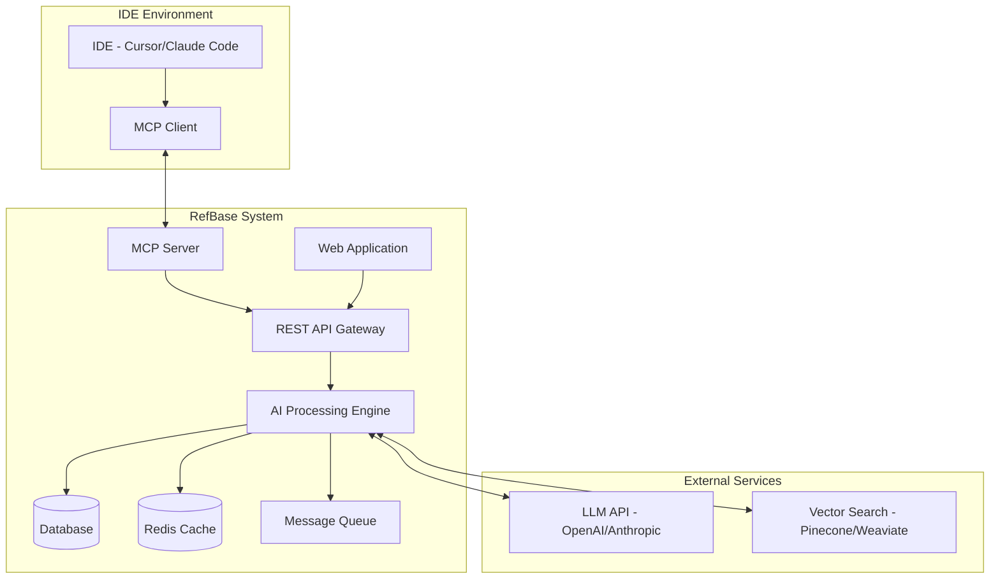

# Design Document

## Overview

RefBase is a hybrid webapp/MCP server system that creates an intelligent development knowledge base. The system consists of three main components: an MCP server for IDE integration, a web application for user interaction and management, and an AI processing engine for intelligent analysis and pattern recognition.

The architecture follows a microservices approach with clear separation between data collection (MCP server), data processing (AI engine), and user interaction (webapp). This design ensures scalability, maintainability, and seamless integration with existing development workflows.

## Architecture

### High-Level Architecture



### Component Architecture

The system is built using a modular architecture with the following layers:

1. **Presentation Layer**: React-based web application with real-time updates
2. **API Layer**: Express.js REST API with GraphQL endpoints for complex queries
3. **Business Logic Layer**: Node.js services handling core functionality
4. **Data Layer**: PostgreSQL for structured data, Vector database for semantic search
5. **Integration Layer**: MCP server for IDE communication

## Components and Interfaces

### MCP Server Component

**Purpose**: Handles communication with IDEs and chat history extraction

**Key Interfaces**:
- `ChatHistoryExporter`: Extracts conversation data from IDE sessions
- `ConnectionManager`: Manages IDE connections and authentication
- `DataTransformer`: Converts IDE-specific formats to standardized format

**Implementation Details**:
```typescript
interface MCPServerConfig {
  name: string;
  version: string;
  capabilities: {
    chatExport: boolean;
    realTimeSync: boolean;
    bulkExport: boolean;
  };
}

interface ChatMessage {
  id: string;
  timestamp: Date;
  role: 'user' | 'assistant';
  content: string;
  codeBlocks?: CodeBlock[];
  context?: ConversationContext;
}

interface ConversationContext {
  projectPath: string;
  activeFiles: string[];
  gitBranch?: string;
  sessionId: string;
}
```

### Web Application Component

**Purpose**: Provides user interface for managing and exploring the knowledge base

**Key Features**:
- Dashboard with analytics and insights
- Search interface with advanced filtering
- Bug report and feature management
- Project organization and tagging
- Team collaboration features

**Technology Stack**:
- Frontend: React 18 with TypeScript
- State Management: Zustand for client state
- UI Framework: Tailwind CSS with Headless UI
- Real-time: Socket.io for live updates

### AI Processing Engine

**Purpose**: Analyzes conversations and extracts meaningful patterns and insights

**Key Capabilities**:
- Natural language processing for categorization
- Code pattern recognition and extraction
- Similarity detection and clustering
- Automated tagging and metadata generation

**Processing Pipeline**:
```typescript
interface ProcessingPipeline {
  stages: [
    'ingestion',
    'preprocessing', 
    'analysis',
    'categorization',
    'pattern_extraction',
    'indexing'
  ];
}

interface AnalysisResult {
  category: string;
  confidence: number;
  extractedPatterns: CodePattern[];
  suggestedTags: string[];
  relatedConversations: string[];
}
```

### Database Schema

**Conversations Table**:
```sql
CREATE TABLE conversations (
  id UUID PRIMARY KEY,
  session_id VARCHAR(255),
  project_id UUID REFERENCES projects(id),
  title VARCHAR(500),
  category VARCHAR(100),
  created_at TIMESTAMP,
  updated_at TIMESTAMP,
  metadata JSONB
);
```

**Messages Table**:
```sql
CREATE TABLE messages (
  id UUID PRIMARY KEY,
  conversation_id UUID REFERENCES conversations(id),
  role VARCHAR(20),
  content TEXT,
  code_blocks JSONB,
  timestamp TIMESTAMP,
  processed BOOLEAN DEFAULT FALSE
);
```

**Patterns Table**:
```sql
CREATE TABLE patterns (
  id UUID PRIMARY KEY,
  name VARCHAR(255),
  description TEXT,
  pattern_type VARCHAR(100),
  success_rate DECIMAL(3,2),
  usage_count INTEGER DEFAULT 0,
  code_template TEXT,
  tags TEXT[]
);
```

## Data Models

### Core Domain Models

**Conversation Model**:
```typescript
interface Conversation {
  id: string;
  sessionId: string;
  projectId: string;
  title: string;
  category: ConversationCategory;
  messages: Message[];
  extractedPatterns: Pattern[];
  tags: string[];
  createdAt: Date;
  updatedAt: Date;
  metadata: ConversationMetadata;
}

enum ConversationCategory {
  BUG_FIX = 'bug_fix',
  FEATURE_IMPLEMENTATION = 'feature_implementation',
  DEBUGGING = 'debugging',
  CODE_REVIEW = 'code_review',
  LEARNING = 'learning',
  REFACTORING = 'refactoring'
}
```

**Pattern Model**:
```typescript
interface Pattern {
  id: string;
  name: string;
  description: string;
  type: PatternType;
  codeTemplate: string;
  successRate: number;
  usageCount: number;
  relatedConversations: string[];
  tags: string[];
  difficulty: 'beginner' | 'intermediate' | 'advanced';
}

enum PatternType {
  SOLUTION_PATTERN = 'solution_pattern',
  ANTI_PATTERN = 'anti_pattern',
  BEST_PRACTICE = 'best_practice',
  DEBUGGING_APPROACH = 'debugging_approach'
}
```

**Bug Report Model**:
```typescript
interface BugReport {
  id: string;
  title: string;
  description: string;
  status: BugStatus;
  priority: Priority;
  projectId: string;
  relatedConversations: string[];
  reproductionSteps: string[];
  resolution?: Resolution;
  createdAt: Date;
  updatedAt: Date;
}

enum BugStatus {
  OPEN = 'open',
  IN_PROGRESS = 'in_progress',
  RESOLVED = 'resolved',
  CLOSED = 'closed'
}
```

### Vector Embeddings for Semantic Search

```typescript
interface ConversationEmbedding {
  conversationId: string;
  embedding: number[];
  metadata: {
    category: string;
    tags: string[];
    codeLanguages: string[];
    complexity: number;
  };
}
```

## Error Handling

### MCP Server Error Handling

```typescript
class MCPServerError extends Error {
  constructor(
    message: string,
    public code: string,
    public retryable: boolean = false
  ) {
    super(message);
  }
}

interface ErrorRecoveryStrategy {
  maxRetries: number;
  backoffStrategy: 'exponential' | 'linear';
  fallbackAction?: () => Promise<void>;
}
```

### API Error Responses

```typescript
interface APIErrorResponse {
  error: {
    code: string;
    message: string;
    details?: any;
    timestamp: string;
    requestId: string;
  };
}

enum ErrorCodes {
  VALIDATION_ERROR = 'VALIDATION_ERROR',
  PROCESSING_ERROR = 'PROCESSING_ERROR',
  RATE_LIMIT_EXCEEDED = 'RATE_LIMIT_EXCEEDED',
  EXTERNAL_SERVICE_ERROR = 'EXTERNAL_SERVICE_ERROR'
}
```

### Graceful Degradation

- **Offline Mode**: Cache recent conversations for offline browsing
- **Partial Processing**: Continue with available data when AI services are unavailable
- **Fallback Search**: Use basic text search when vector search fails
- **Manual Categorization**: Allow users to manually categorize when AI fails

## Testing Strategy

### Unit Testing

**MCP Server Tests**:
```typescript
describe('ChatHistoryExporter', () => {
  it('should extract complete conversation threads', async () => {
    // Test conversation extraction logic
  });
  
  it('should handle connection failures gracefully', async () => {
    // Test error handling and retry logic
  });
});
```

**AI Processing Tests**:
```typescript
describe('PatternExtractor', () => {
  it('should identify code patterns correctly', async () => {
    // Test pattern recognition accuracy
  });
  
  it('should categorize conversations appropriately', async () => {
    // Test categorization logic
  });
});
```

### Integration Testing

**End-to-End Workflow Tests**:
- IDE connection → Chat export → Processing → Storage → Retrieval
- Bug report creation → Pattern matching → Resolution tracking
- Feature implementation → Pattern extraction → Knowledge base update

### Performance Testing

**Load Testing Scenarios**:
- Concurrent chat history exports from multiple IDEs
- Large conversation processing (1000+ messages)
- High-frequency search queries
- Real-time synchronization under load

**Performance Targets**:
- Chat export: < 2 seconds for 100 messages
- Search response: < 500ms for semantic search
- Pattern extraction: < 5 seconds per conversation
- Real-time sync: < 100ms latency

### Security Testing

**Authentication & Authorization**:
- MCP server authentication with IDEs
- API token validation and rotation
- User permission and data isolation testing

**Data Protection**:
- Encryption of sensitive conversation data
- Secure handling of code snippets and project information
- Privacy controls for shared knowledge

### Monitoring and Observability

**Key Metrics**:
- MCP connection health and uptime
- Processing pipeline success rates
- Search query performance and accuracy
- User engagement and feature adoption

**Logging Strategy**:
- Structured logging with correlation IDs
- Performance metrics collection
- Error tracking and alerting
- User activity analytics

**Health Checks**:
- MCP server connectivity status
- Database connection health
- External service availability
- Processing queue status