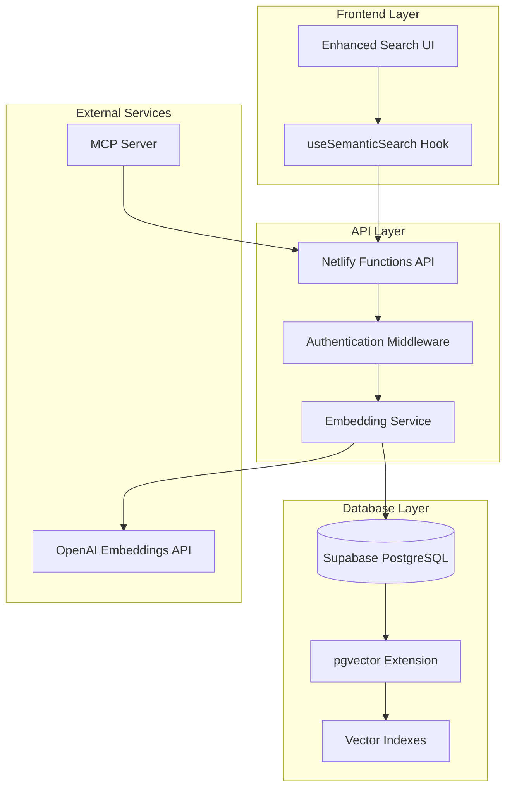

# Design Document

## Overview

The semantic search feature enhances RefBase's existing keyword-based search with vector embeddings to understand contextual meaning. This design leverages Supabase's pgvector extension for efficient vector storage and retrieval, OpenAI's embedding models for text vectorization, and maintains full backward compatibility with existing search functionality.

The implementation follows a hybrid approach where users can choose between keyword search (existing), semantic search (new), or hybrid search (combining both) modes. The MCP server integration ensures AI assistants can leverage improved search capabilities while maintaining API compatibility.

## Architecture

### High-Level Architecture



### Data Flow

1. **Content Ingestion**: New content (conversations, bugs, features) triggers embedding generation
2. **Embedding Generation**: Text content is processed and sent to OpenAI for vectorization
3. **Vector Storage**: Embeddings are stored in PostgreSQL with pgvector extension
4. **Search Processing**: User queries are converted to embeddings and matched against stored vectors
5. **Result Ranking**: Semantic similarity scores are calculated and results are ranked
6. **Hybrid Merging**: Semantic and keyword results are combined when hybrid mode is used

## Components and Interfaces

### 1. Database Schema Extensions

#### Vector Columns Addition
```sql
-- Add embedding columns to existing tables
ALTER TABLE conversations 
ADD COLUMN content_embedding vector(1536),
ADD COLUMN title_embedding vector(1536),
ADD COLUMN embedding_model text DEFAULT 'text-embedding-3-small',
ADD COLUMN embedding_created_at timestamp with time zone;

ALTER TABLE bugs 
ADD COLUMN content_embedding vector(1536),
ADD COLUMN title_embedding vector(1536),
ADD COLUMN embedding_model text DEFAULT 'text-embedding-3-small',
ADD COLUMN embedding_created_at timestamp with time zone;

ALTER TABLE features 
ADD COLUMN content_embedding vector(1536),
ADD COLUMN title_embedding vector(1536),
ADD COLUMN embedding_model text DEFAULT 'text-embedding-3-small',
ADD COLUMN embedding_created_at timestamp with time zone;

ALTER TABLE documents 
ADD COLUMN content_embedding vector(1536),
ADD COLUMN title_embedding vector(1536),
ADD COLUMN embedding_model text DEFAULT 'text-embedding-3-small',
ADD COLUMN embedding_created_at timestamp with time zone;
```

#### Vector Indexes
```sql
-- Create IVFFLAT indexes for efficient similarity search
CREATE INDEX conversations_content_embedding_idx ON conversations 
USING ivfflat (content_embedding vector_cosine_ops) WITH (lists = 100);

CREATE INDEX conversations_title_embedding_idx ON conversations 
USING ivfflat (title_embedding vector_cosine_ops) WITH (lists = 100);

-- Similar indexes for bugs, features, and documents
```

#### Search Functions
```sql
-- Semantic search function for conversations
CREATE OR REPLACE FUNCTION search_conversations_semantic(
  query_embedding vector(1536),
  project_id_filter uuid DEFAULT NULL,
  match_threshold float DEFAULT 0.7,
  match_count int DEFAULT 10
)
RETURNS TABLE (
  id uuid,
  title text,
  content text,
  tags text[],
  created_at timestamp with time zone,
  similarity float
)
LANGUAGE plpgsql
AS $$
BEGIN
  RETURN QUERY
  SELECT 
    c.id,
    c.title,
    left(array_to_string(array(select jsonb_array_elements_text(m.value->'content') 
         from jsonb_array_elements(c.messages) m), ' '), 500) as content,
    c.tags,
    c.created_at,
    greatest(
      1 - (c.content_embedding <=> query_embedding),
      1 - (c.title_embedding <=> query_embedding)
    ) as similarity
  FROM conversations c
  WHERE 
    (project_id_filter IS NULL OR c.project_id = project_id_filter)
    AND (
      c.content_embedding <=> query_embedding < 1 - match_threshold
      OR c.title_embedding <=> query_embedding < 1 - match_threshold
    )
  ORDER BY similarity DESC
  LIMIT match_count;
END;
$$;
```

### 2. Embedding Service

#### Core Service Interface
```typescript
interface EmbeddingService {
  generateEmbedding(text: string): Promise<number[]>;
  generateConversationEmbeddings(conversation: ConversationData): Promise<EmbeddingResult>;
  generateBugEmbeddings(bug: BugData): Promise<EmbeddingResult>;
  generateFeatureEmbeddings(feature: FeatureData): Promise<EmbeddingResult>;
  searchConversations(query: string, options: SearchOptions): Promise<SearchResult[]>;
  searchBugs(query: string, options: SearchOptions): Promise<SearchResult[]>;
  searchFeatures(query: string, options: SearchOptions): Promise<SearchResult[]>;
  searchAll(query: string, options: SearchOptions): Promise<CombinedSearchResult>;
}

interface SearchOptions {
  projectId?: string;
  threshold?: number;
  limit?: number;
  includeHybrid?: boolean;
  searchType?: 'semantic' | 'text' | 'hybrid';
}

interface SearchResult {
  id: string;
  title: string;
  content: string;
  similarity: number;
  searchType: 'semantic' | 'text' | 'hybrid';
  type: 'conversation' | 'bug' | 'feature' | 'document';
  created_at: string;
  tags?: string[];
}
```

#### Implementation Details
```typescript
export class EmbeddingService {
  private openai: OpenAI;
  private readonly EMBEDDING_MODEL = 'text-embedding-3-small';
  private readonly EMBEDDING_DIMENSION = 1536;
  private readonly MAX_TEXT_LENGTH = 32000; // ~8000 tokens

  constructor() {
    this.openai = new OpenAI({
      apiKey: process.env.OPENAI_API_KEY,
    });
  }

  async generateEmbedding(text: string): Promise<number[]> {
    const cleanText = this.preprocessText(text);
    
    const response = await this.openai.embeddings.create({
      model: this.EMBEDDING_MODEL,
      input: cleanText,
      dimensions: this.EMBEDDING_DIMENSION,
    });

    return response.data[0].embedding;
  }

  private preprocessText(text: string): string {
    // Remove excessive whitespace and special characters
    let processed = text
      .replace(/\s+/g, ' ')
      .replace(/[^\w\s\-_.]/g, ' ')
      .trim();

    // Truncate to reasonable length
    if (processed.length > this.MAX_TEXT_LENGTH) {
      processed = processed.substring(0, this.MAX_TEXT_LENGTH);
    }

    return processed;
  }

  async generateConversationEmbeddings(conversation: ConversationData) {
    const contentText = this.extractConversationContent(conversation.messages);
    
    const [titleEmbedding, contentEmbedding] = await Promise.all([
      this.generateEmbedding(conversation.title),
      this.generateEmbedding(contentText),
    ]);

    // Store in database
    await supabase
      .from('conversations')
      .update({
        title_embedding: titleEmbedding,
        content_embedding: contentEmbedding,
        embedding_model: this.EMBEDDING_MODEL,
        embedding_created_at: new Date().toISOString(),
      })
      .eq('id', conversation.id);

    return { titleEmbedding, contentEmbedding };
  }

  private extractConversationContent(messages: any[]): string {
    return messages
      .map(msg => {
        const content = typeof msg.content === 'string' ? msg.content : JSON.stringify(msg.content);
        return `${msg.role}: ${content}`;
      })
      .join('\n\n')
      .substring(0, 50000); // Limit content size
  }
}
```

### 3. API Endpoints

#### New Semantic Search Endpoint
```typescript
// POST /api/search/semantic
app.post('/api/search/semantic', authenticateUser, async (req, res) => {
  try {
    const user = (req as any).user;
    const { 
      query, 
      projectId, 
      type = 'all', 
      options = {} 
    } = req.body;

    if (!query) {
      return res.status(400).json({ 
        success: false, 
        error: 'Query is required' 
      });
    }

    const embeddingService = new EmbeddingService();
    let results;

    switch (type) {
      case 'conversations':
        results = await embeddingService.searchConversations(query, {
          projectId,
          ...options
        });
        break;
      case 'bugs':
        results = await embeddingService.searchBugs(query, {
          projectId,
          ...options
        });
        break;
      case 'features':
        results = await embeddingService.searchFeatures(query, {
          projectId,
          ...options
        });
        break;
      case 'all':
        results = await embeddingService.searchAll(query, {
          projectId,
          ...options
        });
        break;
      default:
        return res.status(400).json({ 
          success: false, 
          error: 'Invalid search type' 
        });
    }

    res.json({
      success: true,
      query,
      results,
      searchType: 'semantic',
      timestamp: new Date().toISOString(),
    });

  } catch (error) {
    console.error('Semantic search error:', error);
    res.status(500).json({ 
      success: false, 
      error: 'Internal server error' 
    });
  }
});
```

#### Enhanced Existing Endpoints
```typescript
// Enhanced GET /api/conversations with semantic search support
app.get('/api/conversations', authenticateUser, async (req, res) => {
  try {
    const user = (req as any).user;
    const { 
      query, 
      searchType = 'keyword', // 'keyword', 'semantic', 'hybrid'
      tags, 
      project, 
      limit = 10, 
      offset = 0 
    } = req.query;

    if (searchType === 'semantic' || searchType === 'hybrid') {
      const embeddingService = new EmbeddingService();
      const results = await embeddingService.searchConversations(query, {
        projectId: project,
        searchType,
        limit: Number(limit),
        threshold: 0.7
      });
      
      return res.json({ 
        success: true, 
        data: results,
        count: results.length,
        searchType
      });
    }

    // Existing keyword search logic...
    // [Previous implementation remains unchanged]
    
  } catch (error) {
    console.error('Search conversations error:', error);
    res.status(500).json({ success: false, error: 'Internal server error' });
  }
});
```

### 4. Frontend Components

#### Enhanced Search Hook
```typescript
interface UseSemanticSearchReturn {
  results: SearchResult[];
  loading: boolean;
  error: string | null;
  search: (query: string, options?: SearchOptions) => Promise<void>;
  clearResults: () => void;
}

export const useSemanticSearch = (): UseSemanticSearchReturn => {
  const [results, setResults] = useState<SearchResult[]>([]);
  const [loading, setLoading] = useState(false);
  const [error, setError] = useState<string | null>(null);

  const search = useCallback(async (
    query: string,
    options: SearchOptions = {}
  ) => {
    if (!query.trim()) {
      setResults([]);
      return;
    }

    setLoading(true);
    setError(null);

    try {
      const response = await fetch('/api/search/semantic', {
        method: 'POST',
        headers: {
          'Content-Type': 'application/json',
          'Authorization': `Bearer ${getAuthToken()}`,
        },
        body: JSON.stringify({
          query: query.trim(),
          projectId: options.projectId,
          type: options.type || 'all',
          options: {
            threshold: options.threshold || 0.7,
            limit: options.limit || 20,
            includeHybrid: options.includeHybrid ?? true,
            searchType: options.searchType || 'hybrid',
          },
        }),
      });

      if (!response.ok) {
        throw new Error(`Search failed: ${response.statusText}`);
      }

      const data = await response.json();
      setResults(data.results);
    } catch (err) {
      console.error('Search error:', err);
      setError(err instanceof Error ? err.message : 'Search failed');
      setResults([]);
    } finally {
      setLoading(false);
    }
  }, []);

  const clearResults = useCallback(() => {
    setResults([]);
    setError(null);
  }, []);

  return {
    results,
    loading,
    error,
    search,
    clearResults,
  };
};
```

#### Enhanced Search Component
```typescript
interface SemanticSearchBarProps {
  project?: Project;
  onResultSelect?: (result: SearchResult) => void;
  placeholder?: string;
}

export const SemanticSearchBar: React.FC<SemanticSearchBarProps> = ({
  project,
  onResultSelect,
  placeholder = "Search conversations, bugs, and features..."
}) => {
  const { isDark } = useTheme();
  const [query, setQuery] = useState('');
  const [searchMode, setSearchMode] = useState<'semantic' | 'text' | 'hybrid'>('hybrid');
  const [searchType, setSearchType] = useState<'all' | 'conversations' | 'bugs' | 'features'>('all');
  const [showAdvanced, setShowAdvanced] = useState(false);
  
  const { results, loading, error, search, clearResults } = useSemanticSearch();

  const handleSearch = async (e: React.FormEvent) => {
    e.preventDefault();
    if (!query.trim()) return;

    await search(query, {
      projectId: project?.id,
      type: searchType,
      searchType: searchMode,
      includeHybrid: searchMode === 'hybrid',
      threshold: searchMode === 'semantic' ? 0.7 : undefined,
    });
  };

  // Component JSX with enhanced UI...
  return (
    <div className="relative">
      {/* Search form with mode selection */}
      {/* Results display with similarity scores */}
      {/* Error handling and loading states */}
    </div>
  );
};
```

## Data Models

### Enhanced Database Schema

#### Embedding Columns
- `content_embedding`: vector(1536) - Embedding for main content
- `title_embedding`: vector(1536) - Embedding for titles/names
- `embedding_model`: text - Model used for embedding generation
- `embedding_created_at`: timestamp - When embeddings were generated

#### Search Result Model
```typescript
interface SearchResult {
  id: string;
  title: string;
  content: string;
  similarity: number;
  searchType: 'semantic' | 'text' | 'hybrid';
  type: 'conversation' | 'bug' | 'feature' | 'document';
  created_at: string;
  tags?: string[];
  project_id?: string;
  metadata?: Record<string, unknown>;
}
```

#### Embedding Configuration
```typescript
interface EmbeddingConfig {
  model: 'text-embedding-3-small' | 'text-embedding-3-large';
  dimensions: 1536 | 3072;
  maxTokens: number;
  batchSize: number;
  rateLimitDelay: number;
}
```

## Error Handling

### Embedding Generation Errors
1. **API Rate Limits**: Implement exponential backoff and retry logic
2. **Token Limits**: Truncate content intelligently while preserving meaning
3. **Network Failures**: Queue failed embeddings for retry
4. **Invalid Content**: Skip empty or malformed content with logging

### Search Errors
1. **Vector Index Issues**: Fallback to keyword search
2. **Similarity Threshold**: Adjust thresholds dynamically based on result quality
3. **Performance Issues**: Implement query optimization and caching
4. **Empty Results**: Provide helpful suggestions and fallback options

### Migration Errors
1. **Batch Processing**: Process in small batches to avoid timeouts
2. **Partial Failures**: Continue processing and log failed items
3. **Resource Constraints**: Monitor and throttle based on system load
4. **Data Integrity**: Validate embeddings before storage

## Testing Strategy

### Unit Tests
1. **Embedding Service**: Test text preprocessing, API calls, and error handling
2. **Search Functions**: Test SQL functions with various input scenarios
3. **API Endpoints**: Test request/response handling and authentication
4. **Frontend Components**: Test search UI interactions and state management

### Integration Tests
1. **End-to-End Search**: Test complete search flow from query to results
2. **Database Operations**: Test vector storage and retrieval
3. **API Integration**: Test MCP server compatibility
4. **Performance**: Test search response times and throughput

### Migration Tests
1. **Data Processing**: Test embedding generation for existing content
2. **Batch Processing**: Test migration script with various data sizes
3. **Error Recovery**: Test handling of failed embedding generations
4. **Data Integrity**: Verify embeddings are correctly associated with content

### Performance Tests
1. **Search Latency**: Measure response times for various query types
2. **Concurrent Users**: Test system behavior under load
3. **Vector Index Performance**: Optimize index parameters for best performance
4. **Memory Usage**: Monitor embedding storage and retrieval efficiency

## Migration Implementation

### Complete Migration Script
```typescript
// scripts/migrateEmbeddings.ts
import { createClient } from '@supabase/supabase-js';
import OpenAI from 'openai';

const supabase = createClient(
  process.env.VITE_SUPABASE_URL!,
  process.env.SUPABASE_SERVICE_ROLE_KEY! // Service role for migrations
);

const openai = new OpenAI({
  apiKey: process.env.OPENAI_API_KEY!,
});

interface MigrationStats {
  processed: number;
  failed: number;
  skipped: number;
  total: number;
}

class EmbeddingMigration {
  private readonly BATCH_SIZE = 5;
  private readonly RATE_LIMIT_DELAY = 2000; // 2 seconds between batches
  private readonly EMBEDDING_MODEL = 'text-embedding-3-small';

  async migrateConversations(): Promise<MigrationStats> {
    const stats: MigrationStats = { processed: 0, failed: 0, skipped: 0, total: 0 };
    
    console.log('🚀 Starting conversation embeddings migration...');
    
    // Get all conversations without embeddings
    const { data: conversations, error } = await supabase
      .from('conversations')
      .select('id, title, messages')
      .is('content_embedding', null)
      .order('created_at', { ascending: true });

    if (error) {
      console.error('❌ Error fetching conversations:', error);
      return stats;
    }

    stats.total = conversations?.length || 0;
    console.log(`📊 Found ${stats.total} conversations to process`);

    if (!conversations || conversations.length === 0) {
      console.log('✅ No conversations to migrate');
      return stats;
    }

    // Process in batches
    const batches = [];
    for (let i = 0; i < conversations.length; i += this.BATCH_SIZE) {
      batches.push(conversations.slice(i, i + this.BATCH_SIZE));
    }

    for (let batchIndex = 0; batchIndex < batches.length; batchIndex++) {
      const batch = batches[batchIndex];
      console.log(`🔄 Processing batch ${batchIndex + 1}/${batches.length}`);

      const batchPromises = batch.map(async (conversation) => {
        try {
          // Extract content from messages
          const contentText = this.extractConversationContent(conversation.messages);
          
          // Generate embeddings
          const [titleEmbedding, contentEmbedding] = await Promise.all([
            this.generateEmbedding(conversation.title),
            this.generateEmbedding(contentText),
          ]);

          // Store in database
          await supabase
            .from('conversations')
            .update({
              title_embedding: titleEmbedding,
              content_embedding: contentEmbedding,
              embedding_model: this.EMBEDDING_MODEL,
              embedding_created_at: new Date().toISOString(),
            })
            .eq('id', conversation.id);

          stats.processed++;
          console.log(`  ✅ Processed: ${conversation.title}`);
        } catch (error) {
          stats.failed++;
          console.error(`  ❌ Failed: ${conversation.title}`, error);
        }
      });

      await Promise.all(batchPromises);
      
      // Rate limiting between batches
      if (batchIndex < batches.length - 1) {
        console.log('⏱️  Waiting before next batch...');
        await new Promise(resolve => setTimeout(resolve, this.RATE_LIMIT_DELAY));
      }
    }

    return stats;
  }

  private extractConversationContent(messages: any[]): string {
    return messages
      .map(msg => {
        const content = typeof msg.content === 'string' 
          ? msg.content 
          : JSON.stringify(msg.content);
        return `${msg.role}: ${content}`;
      })
      .join('\n\n')
      .substring(0, 50000); // Limit to ~12k tokens
  }

  private async generateEmbedding(text: string): Promise<number[]> {
    const cleanText = text
      .replace(/\s+/g, ' ')
      .replace(/[^\w\s\-_.]/g, ' ')
      .trim()
      .substring(0, 32000); // ~8k tokens max

    const response = await openai.embeddings.create({
      model: this.EMBEDDING_MODEL,
      input: cleanText,
      dimensions: 1536,
    });

    return response.data[0].embedding;
  }

  async runMigration() {
    console.log('🎯 Starting RefBase Semantic Search Migration');
    console.log('=' .repeat(50));
    
    const startTime = Date.now();
    
    try {
      // Test connections
      const { error: testError } = await supabase
        .from('conversations')
        .select('id')
        .limit(1);
      
      if (testError) {
        throw new Error(`Database connection failed: ${testError.message}`);
      }
      console.log('✅ Database connection verified');

      // Test OpenAI API
      await this.generateEmbedding('test');
      console.log('✅ OpenAI API connection verified');

      // Run migrations
      const conversationsStats = await this.migrateConversations();
      // Similar for bugs and features...

      const duration = ((Date.now() - startTime) / 1000).toFixed(2);
      console.log(`\n⏱️  Migration completed in ${duration} seconds`);
      console.log(`✅ Success rate: ${((conversationsStats.processed / conversationsStats.total) * 100).toFixed(1)}%`);
      
    } catch (error) {
      console.error('\n💥 Migration failed:', error);
      process.exit(1);
    }
  }
}

// Run migration
if (require.main === module) {
  new EmbeddingMigration().runMigration();
}
```

## Caching Implementation

### Search Cache Service
```typescript
// src/services/SearchCache.ts
import { LRUCache } from 'lru-cache';

interface CachedSearchResult {
  results: any[];
  timestamp: number;
  query: string;
  searchType: string;
}

export class SearchCache {
  private cache: LRUCache<string, CachedSearchResult>;
  private readonly CACHE_TTL = 5 * 60 * 1000; // 5 minutes

  constructor() {
    this.cache = new LRUCache({
      max: 1000, // Max 1000 cached searches
      ttl: this.CACHE_TTL,
    });
  }

  private generateCacheKey(
    query: string, 
    projectId?: string, 
    type?: string, 
    options?: any
  ): string {
    return `${query}:${projectId || 'all'}:${type || 'all'}:${JSON.stringify(options || {})}`;
  }

  get(query: string, projectId?: string, type?: string, options?: any): CachedSearchResult | null {
    const key = this.generateCacheKey(query, projectId, type, options);
    const cached = this.cache.get(key);
    
    if (cached && Date.now() - cached.timestamp < this.CACHE_TTL) {
      console.log('Cache hit for query:', query);
      return cached;
    }
    
    return null;
  }

  set(query: string, results: any[], projectId?: string, type?: string, options?: any): void {
    const key = this.generateCacheKey(query, projectId, type, options);
    this.cache.set(key, {
      results,
      timestamp: Date.now(),
      query,
      searchType: type || 'all',
    });
  }

  clear(): void {
    this.cache.clear();
  }

  // Invalidate cache for specific project when content changes
  invalidateProject(projectId: string): void {
    for (const [key] of this.cache.entries()) {
      if (key.includes(projectId)) {
        this.cache.delete(key);
      }
    }
  }
}
```

## Feature Flag Configuration

### Environment Configuration
```typescript
// src/config/features.ts
export const FEATURES = {
  SEMANTIC_SEARCH_ENABLED: process.env.SEMANTIC_SEARCH_ENABLED === 'true',
  EMBEDDING_GENERATION: process.env.OPENAI_API_KEY ? true : false,
  SEARCH_ANALYTICS: true,
  HYBRID_SEARCH_DEFAULT: true,
  CACHE_ENABLED: true,
} as const;

// .env file additions
SEMANTIC_SEARCH_ENABLED=true
OPENAI_API_KEY=sk-your-openai-api-key-here
EMBEDDING_BATCH_SIZE=10
SEARCH_CACHE_TTL=300
SUPABASE_SERVICE_ROLE_KEY=your-service-role-key-for-migrations
```

### Graceful Fallback Implementation
```typescript
// src/services/SearchService.ts
export class SearchService {
  private embeddingService: EmbeddingService | null = null;
  private cache: SearchCache;
  
  constructor() {
    this.cache = new SearchCache();
    
    // Only initialize embedding service if enabled
    if (FEATURES.SEMANTIC_SEARCH_ENABLED && process.env.OPENAI_API_KEY) {
      this.embeddingService = new EmbeddingService();
    }
  }

  async search(query: string, options: SearchOptions): Promise<SearchResult[]> {
    // Check cache first
    if (FEATURES.CACHE_ENABLED) {
      const cached = this.cache.get(query, options.projectId, options.type);
      if (cached) return cached.results;
    }

    try {
      // Try semantic search if enabled
      if (FEATURES.SEMANTIC_SEARCH_ENABLED && this.embeddingService) {
        const results = await this.embeddingService.searchConversations(query, options);
        
        // Cache successful results
        if (FEATURES.CACHE_ENABLED) {
          this.cache.set(query, results, options.projectId, options.type);
        }
        
        return results;
      }
    } catch (error) {
      console.error('Semantic search failed, falling back to keyword search:', error);
      // Continue to fallback...
    }

    // Fallback to keyword search
    return this.keywordSearch(query, options);
  }

  private async keywordSearch(query: string, options: SearchOptions): Promise<SearchResult[]> {
    // Existing keyword search implementation
    const { data, error } = await supabase
      .from('conversations')
      .select('*')
      .textSearch('title', query)
      .limit(options.limit || 10);

    if (error) throw error;
    
    return data.map(item => ({
      ...item,
      similarity: 0.5, // Default similarity for keyword matches
      searchType: 'text' as const,
    }));
  }
}
```

## Security Considerations

### API Security
1. **Authentication**: Maintain existing JWT and API key authentication
2. **Rate Limiting**: Implement per-user rate limits for embedding generation
3. **Input Validation**: Sanitize search queries and content before processing
4. **Access Control**: Ensure users can only search their own content

### Data Privacy
1. **Embedding Storage**: Embeddings don't contain readable text but represent semantic meaning
2. **External API**: Content sent to OpenAI for embedding generation (consider data policies)
3. **Audit Logging**: Log search queries for debugging while respecting privacy
4. **Data Retention**: Implement policies for embedding lifecycle management

### Performance Security
1. **Resource Limits**: Prevent abuse through query complexity limits
2. **Caching**: Implement secure caching to reduce API calls
3. **Monitoring**: Track unusual usage patterns
4. **Graceful Degradation**: Ensure system remains functional if semantic search fails