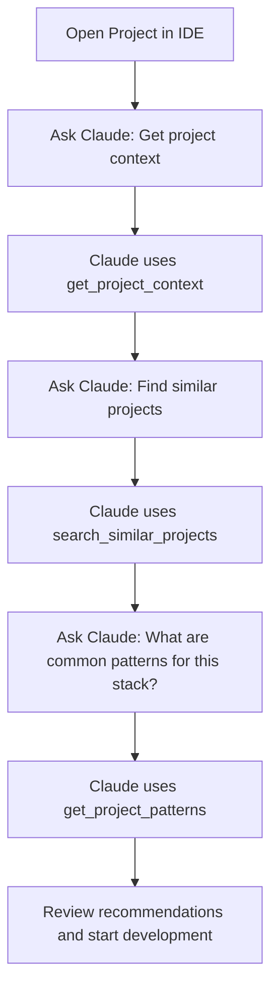

# RefBase MCP - Use Cases and Workflows

This document provides practical examples and workflows for using the RefBase MCP effectively in different development scenarios.

## Table of Contents

1. [Common Use Cases](#common-use-cases)
2. [Development Workflows](#development-workflows)
3. [Team Collaboration Examples](#team-collaboration-examples)
4. [Advanced Scenarios](#advanced-scenarios)
5. [Best Practices Examples](#best-practices-examples)

---

## Common Use Cases

### 1. Bug Resolution Workflow

**Scenario:** You encounter a bug and want to check if it's been solved before.

**Step-by-Step Workflow:**

1. **Search for similar issues first:**
   ```
   Ask Claude: "Search for bugs related to user authentication validation"
   ```
   Claude uses `search_bugs` with query: "user authentication validation"

2. **If no solution found, log the new bug:**
   ```
   Ask Claude: "Log this bug: Login form accepts invalid emails"
   ```
   Claude uses `save_bug` with details about the issue

3. **Save the debugging conversation:**
   ```
   Ask Claude: "Save this conversation about fixing the email validation bug"
   ```
   Claude uses `save_conversation` to preserve the discussion

4. **Update bug status when resolved:**
   ```
   Ask Claude: "Mark bug #123 as resolved with the email regex solution"
   ```
   Claude uses `update_bug_status` to close the bug

**Benefits:**
- Avoid duplicate work by finding existing solutions
- Build a knowledge base of common issues
- Track resolution progress
- Preserve debugging insights for future reference

### 2. Feature Implementation Workflow

**Scenario:** Implementing a new authentication system.

**Step-by-Step Workflow:**

1. **Check for existing implementations:**
   ```
   Ask Claude: "Search for JWT authentication middleware implementations"
   ```
   Claude uses `search_features` to find existing solutions

2. **Get project context for better implementation:**
   ```
   Ask Claude: "What's the current tech stack and structure of this project?"
   ```
   Claude uses `get_project_context` to understand the environment

3. **Find similar projects for patterns:**
   ```
   Ask Claude: "Find projects similar to ours with authentication systems"
   ```
   Claude uses `search_similar_projects` for reference architectures

4. **Implement and save the solution:**
   ```
   After implementation...
   Ask Claude: "Save this JWT middleware implementation as a reusable feature"
   ```
   Claude uses `save_feature` to store the working solution

5. **Document the conversation:**
   ```
   Ask Claude: "Save our discussion about implementing JWT authentication"
   ```
   Claude uses `save_conversation` for future reference

### 3. Code Review and Knowledge Sharing

**Scenario:** Reviewing code and sharing solutions with the team.

**Step-by-Step Workflow:**

1. **Check for similar implementations:**
   ```
   Ask Claude: "Are there existing patterns for API error handling in our codebase?"
   ```
   Claude uses `get_project_patterns` to find established approaches

2. **Save successful review insights:**
   ```
   Ask Claude: "Save this error handling pattern as a best practice"
   ```
   Claude uses `save_feature` to document the approach

3. **Log issues found during review:**
   ```
   Ask Claude: "Log this potential performance issue in the user search"
   ```
   Claude uses `save_bug` to track the concern

4. **Preserve the review discussion:**
   ```
   Ask Claude: "Save this code review conversation"
   ```
   Claude uses `save_conversation` to retain insights

---

## Development Workflows

### New Project Setup Workflow

**When starting work on a new project:**



**Example Conversation:**
```
You: "I just opened a new React + TypeScript project. Help me understand what I'm working with."

Claude: [Uses get_project_context] "This is a React TypeScript project using Vite, with Tailwind CSS and React Router. I see you have authentication setup and a component-based architecture."

You: "What are some common patterns I should know about for React + TypeScript projects?"

Claude: [Uses get_project_patterns] "Based on similar projects, here are the key patterns:
- Custom hooks for API calls
- Context providers for global state
- TypeScript interfaces in a types/ directory
- Component composition over inheritance"
```

### Daily Development Workflow

**Typical development session:**

1. **Morning Standup Context:**
   ```
   "What bugs were reported yesterday related to the user dashboard?"
   [Claude uses search_bugs with filters]
   ```

2. **Before Writing New Code:**
   ```
   "Has anyone implemented user profile editing before?"
   [Claude uses search_features to check existing solutions]
   ```

3. **During Development:**
   ```
   "Save this conversation about implementing the profile editor"
   [Claude uses save_conversation to preserve insights]
   ```

4. **When Finding Issues:**
   ```
   "Log this validation bug in the profile form"
   [Claude uses save_bug to track the issue]
   ```

5. **After Successful Implementation:**
   ```
   "Save this profile editing component as a reusable feature"
   [Claude uses save_feature to document the solution]
   ```

### Debugging Workflow

**When investigating complex issues:**

1. **Check for known issues:**
   ```
   "Search for bugs related to database connection timeouts"
   ```

2. **Get project context for debugging:**
   ```
   "What's our current database setup and connection handling?"
   ```

3. **Document the investigation:**
   ```
   "Save this debugging session for the timeout issue"
   ```

4. **Update knowledge base:**
   ```
   "Save the connection pooling solution we implemented"
   ```

---

## Team Collaboration Examples

### Knowledge Handover Scenario

**Situation:** Senior developer leaving, needs to transfer knowledge.

**Handover Process:**

1. **Export existing conversations:**
   ```
   Senior Dev: "Claude, search for all my conversations about the payment system architecture"
   ```

2. **Document key decisions:**
   ```
   Senior Dev: "Save this conversation explaining why we chose Stripe over PayPal"
   ```

3. **Create feature documentation:**
   ```
   Senior Dev: "Save our payment processing implementation with all the error handling"
   ```

4. **Junior developer onboarding:**
   ```
   Junior Dev: "Search for features related to payment processing"
   Junior Dev: "What conversations exist about payment system decisions?"
   ```

### Cross-Team Bug Resolution

**Situation:** Frontend team encounters backend-related issues.

1. **Frontend developer logs the issue:**
   ```
   "Log this API response format bug affecting the user list display"
   ```

2. **Backend developer searches for context:**
   ```
   "Search for bugs related to user list API responses"
   ```

3. **Resolution discussion:**
   ```
   "Save this conversation between frontend and backend teams about API contracts"
   ```

4. **Solution documentation:**
   ```
   "Save the standardized API response format as a feature"
   ```

### Code Review Collaboration

**Remote team code review process:**

1. **Reviewer preparation:**
   ```
   "Search for existing patterns for React component state management"
   ```

2. **Review documentation:**
   ```
   "Save this code review discussion about component architecture"
   ```

3. **Best practice creation:**
   ```
   "Save the agreed-upon component structure pattern as a feature"
   ```

---

## Advanced Scenarios

### Large Scale Refactoring

**Scenario:** Migrating from JavaScript to TypeScript.

**Workflow:**
1. **Assess current state:**
   ```
   "Get the current project context and identify JavaScript files"
   ```

2. **Find migration patterns:**
   ```
   "Search for TypeScript migration features and solutions"
   ```

3. **Document migration progress:**
   ```
   "Save each module conversion discussion"
   ```

4. **Track migration issues:**
   ```
   "Log any TypeScript conversion bugs we encounter"
   ```

### Performance Optimization Campaign

**Scenario:** System-wide performance improvements.

**Approach:**
1. **Baseline establishment:**
   ```
   "Save this performance audit conversation with current metrics"
   ```

2. **Solution research:**
   ```
   "Search for performance optimization features in React applications"
   ```

3. **Implementation tracking:**
   ```
   "Save each optimization implementation with before/after metrics"
   ```

4. **Issue documentation:**
   ```
   "Log performance regressions as bugs with detailed reproduction steps"
   ```

### Security Audit Workflow

**Scenario:** Comprehensive security review.

1. **Vulnerability assessment:**
   ```
   "Search for security-related bugs in authentication and data handling"
   ```

2. **Best practices review:**
   ```
   "Get project patterns for security implementations"
   ```

3. **Audit documentation:**
   ```
   "Save this security audit conversation with findings and recommendations"
   ```

4. **Remediation tracking:**
   ```
   "Log each security issue as a high-priority bug"
   ```

---

## Best Practices Examples

### Effective Tagging Strategy

**Use consistent, hierarchical tags:**

```
// Feature tags
"auth", "auth-jwt", "auth-oauth"
"ui", "ui-components", "ui-forms"
"api", "api-rest", "api-graphql"
"db", "db-migrations", "db-queries"

// Bug tags
"bug-critical", "bug-performance", "bug-ui"
"env-production", "env-staging", "env-development"

// Conversation tags
"discussion", "decision", "tutorial", "troubleshooting"
```

**Example Usage:**
```json
{
  "tool": "save_conversation",
  "parameters": {
    "title": "JWT Token Refresh Implementation",
    "tags": ["auth", "auth-jwt", "tutorial", "backend"],
    "messages": [...]
  }
}
```

### Descriptive Titles and Descriptions

**Good Examples:**

✅ **Bug Title:** "User profile form validation fails for email addresses with plus signs"
✅ **Feature Title:** "React custom hook for debounced API search with loading states"
✅ **Conversation Title:** "Team discussion: Choosing between Redux and Context API for state management"

**Poor Examples:**

❌ **Bug Title:** "Form doesn't work"
❌ **Feature Title:** "Search thing"
❌ **Conversation Title:** "Discussion"

### Context-Rich Descriptions

**Feature Documentation Example:**
```json
{
  "title": "JWT Authentication Middleware",
  "description": "Express middleware for validating JWT tokens with automatic refresh and role-based access control",
  "implementation": "Middleware checks Authorization header, validates JWT signature, handles token refresh, and adds user context to request object",
  "techStack": ["node.js", "express", "jsonwebtoken", "typescript"],
  "codeExamples": [
    {
      "language": "typescript",
      "code": "const authMiddleware: RequestHandler = async (req, res, next) => { ... }",
      "description": "Main middleware function with error handling"
    }
  ]
}
```

### Comprehensive Bug Reports

**Detailed Bug Documentation:**
```json
{
  "title": "Shopping cart total calculation incorrect with discount codes",
  "description": "Cart total shows wrong amount when multiple discount codes are applied simultaneously",
  "symptoms": [
    "Total shows higher than expected amount",
    "Discount percentages don't stack correctly",
    "Final checkout amount differs from cart display"
  ],
  "reproduction": "1. Add items to cart 2. Apply first discount code 3. Apply second discount code 4. Observe incorrect total",
  "severity": "high",
  "tags": ["ecommerce", "cart", "discount", "calculation", "bug-critical"]
}
```

---

## Workflow Templates

### New Feature Development Template

```
1. Research Phase:
   - "Search for similar features: [feature description]"
   - "Get current project context"
   - "Find similar projects with [technology/pattern]"

2. Planning Phase:
   - "Save this feature planning conversation"
   - "Document architecture decisions made"

3. Implementation Phase:
   - "Log any bugs encountered during development"
   - "Save working code examples as features"

4. Review Phase:
   - "Save code review discussions"
   - "Update bug status for any issues found"

5. Documentation Phase:
   - "Save the complete feature implementation"
   - "Save any lessons learned conversation"
```

### Bug Investigation Template

```
1. Discovery:
   - "Search for similar bugs: [symptoms]"
   - "Check if this bug was reported before"

2. Investigation:
   - "Save debugging conversation with findings"
   - "Document reproduction steps and environment"

3. Resolution:
   - "Save the solution implementation"
   - "Update bug status with resolution details"

4. Prevention:
   - "Save lessons learned to prevent similar issues"
   - "Document new patterns or practices"
```

### Team Knowledge Sharing Template

```
1. Preparation:
   - "Search for existing documentation on [topic]"
   - "Get relevant project patterns and implementations"

2. Discussion:
   - "Save team discussion about [topic]"
   - "Document decisions and rationale"

3. Implementation:
   - "Save agreed-upon solutions as features"
   - "Create or update best practice documentation"

4. Follow-up:
   - "Track implementation progress"
   - "Save any refinements or improvements"
```

---

These examples demonstrate how the RefBase MCP integrates naturally into development workflows, providing context-aware assistance and building institutional knowledge over time. The key is consistent use and descriptive documentation to maximize the value of the knowledge base.